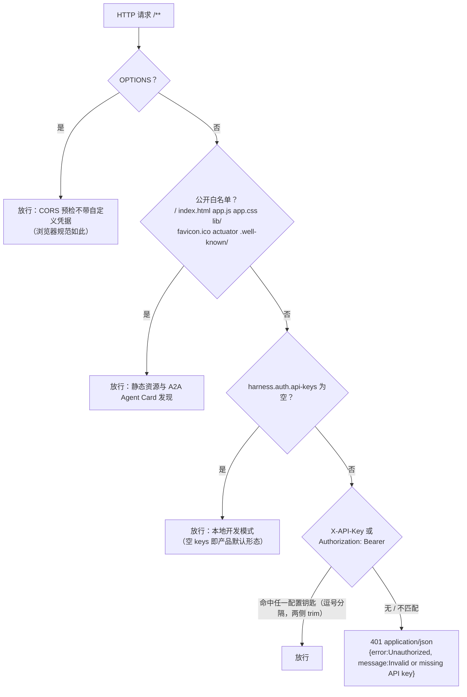

# L02 - 配置中心与 API 认证

**目标**：`harness.yml` 统一配置模型生效（加载、强类型绑定、启动校验、脱敏查询），API Key 认证可开可关，CORS 就位。走完本课，第一个真实 REST 端点 `GET /api/harness/config/effective` 打通全部六层，服务从 8080 默认态迁到 8090 正式态。

**课程位置**：前置 L01（七模块骨架）→ 本课 → 解锁 L03（阻塞式对话 tracer——LLM 配置段自此有真实消费方）。

## 概念与词汇

见 [CONTEXT.md](../../CONTEXT.md)：组合根（infrastructure 的 config）/ trigger 层 / 统一响应信封（Response）/ 端口（Port）/ 适配器（Adapter）。

## 配图一：配置加载链

两种机制叠加，都汇聚到 Spring Environment：

1. **属性源优先级**（谁覆盖谁）：jar 内配置文件（最低）→ jar 旁/工作目录外部文件 → OS 环境变量 → JVM 属性 → 命令行参数（最高）。
2. **占位符兜底链**（单个值内部的回退）：`${LLM_API_KEY:${DEEPSEEK_API_KEY:}}` = 环境变量 `LLM_API_KEY` 没有则退 `DEEPSEEK_API_KEY`，再没有则空串。`spring.config.import` 列表内**后导入者胜**——`file:./harness.yml`（部署覆盖）压过 `classpath:harness.yml`（内置默认）。

```mermaid
graph TD
    APPYML["application.yml<br/>端口 8090 / 日志 / 应用名 / config.import"]
    IMP["spring.config.import<br/>optional:classpath:harness.yml<br/>optional:file:./harness.yml<br/>optional:classpath|file:harness-extensions.yml"]
    HYCL["classpath:harness.yml<br/>统一配置模型（随 jar 分发的默认）"]
    HYF["file:./harness.yml<br/>部署目录现场覆盖（后导入者胜）"]
    EXT["harness-extensions.yml<br/>可选外部扩展覆盖（不入库）"]
    SYS["OS 环境变量 / JVM 属性 / 命令行<br/>LLM_API_KEY 等（属性源优先级更高）"]
    ENV["Spring Environment<br/>合并属性源，${} 占位符在此解析"]

    APPYML --> IMP --> HYCL & HYF & EXT
    HYCL & HYF & EXT & SYS --> ENV

    ENV --> READ["@Value 注入<br/>trigger 拦截器读 api-keys<br/>（逗号串语义）"]
    ENV --> CP["@ConfigurationProperties 绑定<br/>HarnessExtensionsProperties<br/>（强类型，L18/L19 消费）"]
    ENV --> BND["Binder 直接绑 Map / List<br/>校验器 & effective 脱敏投影<br/>（弱类型整树）"]
```

同一份配置三种读法并存：`@Value`（单值）、`@ConfigurationProperties`（强类型对象）、`Binder`（整树弱类型）——vendor 三者都用，各有其位。

## 配图二：拦截器链（ApiKeyAuthInterceptor#preHandle）

判定顺序即安全语义：预检与静态资源先于钥匙校验，空钥匙放行先于凭据检查。

## 精读路线（vendor 源码）

| 文件 | 导读问题 |
|------|---------|
| `app/.../application.yml` + `harness.yml` | `spring.config.import` 四条 optional 各为什么场景？harness.yml 每一段的消费方在哪一课？ |
| `infrastructure/.../config/HarnessExtensionsProperties.java` | 为什么是手写 getter/setter 而非 record？setter 里的 `!= null ? x : 默认` 防什么？ |
| `infrastructure/.../config/HarnessConfigValidator.java` | 为什么自己 `Binder.bind` 而不注入属性类？`afterPropertiesSet` 的 fail-fast 时机在请求服务前还是后？ |
| `infrastructure/.../adapter/config/HarnessEffectiveConfigPort.java` | 两层脱敏各拦什么？键名归一化（去 `-_` 小写）为什么要做？ |
| `case/.../config/HarnessConfigQueryCase.java` | 什么样的用例薄到不需要策略树？ |
| `trigger/.../http/query/HarnessConfigQueryController.java` + `service/query/HarnessConfigQueryApi.java` | `I*Api` 的实现方为什么在 trigger？信封包装与异常折叠在哪一层做？ |
| `trigger/.../filter/ApiKeyAuthInterceptor.java#preHandle()` L32-98 | 四段判定的顺序能换吗？把空钥匙放行挪到最后会怎样？ |
| `trigger/.../filter/WebMvcConfig.java` | CORS 全开的注释理由是什么？`allowCredentials(false)` 为什么是前提？ |

## 实现增量

**做**：`application.yml`（8090 + config.import 链）与 `harness.yml`（统一配置模型全量就位，消费方随课接入）；`HarnessExtensionsProperties` 属性类 + `HarnessConfigValidator` 启动校验 + 最小组合根 `HarnessApplicationConfig`（本课只注册属性类，`@Bean` 自 L03 逐课填）；`IHarnessEffectiveConfigPort`（domain 端口）→ `HarnessEffectiveConfigPort`（infra 脱敏适配器）→ `HarnessConfigQueryCase`（case）→ `IHarnessConfigQueryApi`（api 契约）→ `HarnessConfigQueryApi` + `HarnessConfigQueryController`（trigger）；`ApiKeyAuthInterceptor` + `WebMvcConfig`（拦截器注册 + CORS 全开）。

**不做**：LLM/approval/sandbox/extensions 配置的实际消费方（L03/L13/L18/L19 各自接入）；Spring Security（vendor 明确没有，闸门就是这个拦截器）；datasource/mybatis/management 配置段（L09 / 收尾课）。

**与 vendor 的 pom 差异清单（L02 新增行）**：

| 差异 | 理由 | 收敛课 |
|------|------|--------|
| infrastructure pom 显式声明 `spring-boot`（vendor 经 starter-jdbc 传递获得） | `@ConfigurationProperties`/`Binder` 本课即需，starter-jdbc 属 L09 | L09 后评估随 starter 收敛 |
| trigger pom 显式声明 `slf4j-api`（vendor 同样经 infra 的 starter-jdbc→logback 传递） | 拦截器日志本课即需 | 同上 |
| trigger pom 增 `spring-test`（test scope） | 复刻件增补拦截器单测（vendor 无此测试） | 不收敛（有意增补） |

**搬运测试**：`HarnessConfigValidatorTest`（3 例）、`HarnessEffectiveConfigPortTest`（1 例），改包名搬运（仅另删一处 vendor 未用的 import）；另增补 `ApiKeyAuthInterceptorTest`（7 例，复刻件自建——空放行 / 401 / 双通道凭据 / OPTIONS / 白名单逐项钉住 DoD）。

## 验收清单

- [x] `mvn clean verify` 绿（api 1 / domain 1 / infrastructure 4 / trigger 9，共 15 测试）
- [x] `java -jar` 启动无配置错误：校验器放行 `sandbox.default-mode=WORKSPACE_WRITE` 与 baidu MCP 条目，Tomcat 8090，`Started Application`
- [x] `curl /api/harness/config/effective` 返回信封 `00000`，`llm.deepseek.api-key`、`auth.api-keys` 为 `[MASKED]`，非敏感值（base-url、max-tokens=8192、preset 插件清单）原样可见
- [x] 未配置 api-keys（默认 `[]`）：无凭据请求 200 全放行；`GET /` 静态页 200；`OPTIONS` 200
- [x] 配置 `--harness.auth.api-keys=k1,k2` 后：无头 401（JSON 错误体）；`X-API-Key: k1` 过；`Authorization: Bearer k2` 过；错钥匙 401；OPTIONS 与静态资源仍放行；CORS 预检回显 `Access-Control-Allow-Origin: tauri://localhost` 及方法/时长头

## 踩坑与教学点

1. **「空 keys 即本地开发模式」是产品取舍而非疏漏**：桌面形态（服务只绑回环 + WebView 直连）不需要钥匙，默认全开换取开箱即用；一旦部署者配置了钥匙，同一二进制立即进入防护态。判定顺序里「空放行」排在凭据检查**之前**——闸门的存在感完全由配置驱动，代码无部署形态分支。
2. **`@Value` 看不见 YAML 列表**：`api-keys: []` 在属性源里呈空串，`isBlank()` 命中放行；但若写成 `api-keys: [k1, k2]`，列表被展平成 `api-keys[0]`/`api-keys[1]` 索引键，`@Value("${harness.auth.api-keys:}")` 拿到的是**默认空串**——结果是静默全放行而非报错，比 401 更危险。正确姿势：逗号串（`--harness.auth.api-keys=k1,k2` 或环境变量 `HARNESS_AUTH_APIKEYS`）。想绑列表就换 `@ConfigurationProperties`（`extensions.mcp.servers` 正是这么被消费的）。
3. **CORS 全开的安全边界**：`allowedOriginPatterns("*")` 能成立的前提是 `allowCredentials(false)`——不带 Cookie，全开 origin 只是「允许任何页面读回环接口的响应」。桌面端 Tauri v2 WebView（origin 为 `tauri://localhost` 等）自 2026-09 起原生 fetch 直连本服务绕开 IPC 转发缺陷，浏览器侧强制校验 CORS，SSE 流也依赖这些响应头——这是「来源放开不引入外网暴露面」注释的完整上下文。
4. **两层脱敏，各拦一种泄露**：键名命中敏感词表（归一化去 `-_` 后 contains apikey/password/secret/authorization/token）→ 整值 `[MASKED]`；字符串值内的 URL 凭据参数（`?api_key=xxx`）→ 只掩参数值保留 URL 结构（诊断时仍能看清端点）。细节：占位符未解析时（如未配 `BAIDU_APPBUILDER_API_KEY`）URL 尾部是 `api_key=` 空值，正则 `=[^&\s]+` 要求至少一个字符，不掩也无泄露——掩码规则只为「有值」设计。
5. **校验器与属性类解耦**：`HarnessConfigValidator` 不注入 `HarnessExtensionsProperties` 而是自持 `ConfigurableEnvironment` 用 `Binder` 直绑弱类型——校验面对的是 `List<Map<String,Object>>`（mcp servers 允许任意字段），且 fail-fast 不应依赖某个属性类恰好被注册。组合根 `HarnessApplicationConfig` 本课只立壳（`@EnableConfigurationProperties`），vendor 同名类满载 L03+ 的端口 Bean，无法整块搬运——组合根从第一天起就长在 infrastructure 的 config，不在 app。
6. **第一个端点即完整六层链**：`Controller(trigger.http)` → `IHarnessConfigQueryApi(api)` → 实现方 `HarnessConfigQueryApi(trigger.service，信封包装+异常折叠)` → `IHarnessConfigCase(case)` → `IHarnessEffectiveConfigPort(domain)` → `HarnessEffectiveConfigPort(infrastructure，脱敏)`。api 契约、case 用例、domain 端口全部零 Spring 业务注解依赖——这是后续所有查询端点的模板。
7. **snakeyaml 勘误（L01 差异清单归因有误）**：vendor case 模块的 snakeyaml 消费方是插件清单解析（`PluginArtifactAnalyzerService` 读 JAR 内 `META-INF/plugin.yaml`，L15 课），与配置中心无关——harness.yml 由 Spring Boot 自带的 YAML 支持加载。L01 文档相应行已更正。

## 自测题

1. `api-keys: []` 与 `api-keys: [k1, k2]` 两种写法下 `@Value` 各读到什么？为什么说后者（静默全放行）是比 401 更危险的失败模式？
2. `spring.config.import` 里 classpath 与 `file:` 两个来源各服务什么部署场景？「后导入者胜」发生在属性源合并的哪一步？
3. effective 脱敏为什么放在 infrastructure 适配器里，而不是 controller 或 case 层做？（提示：domain 端口的契约里就承诺了脱敏后的树）
4. `allowedOriginPatterns("*") + allowCredentials(false)` 的组合为什么在回环桌面场景可接受？若未来要带 Cookie，这两处必须怎么改？
5. `HarnessConfigValidator` 为什么自己 `Binder.bind` 而不注入 `HarnessExtensionsProperties`？
