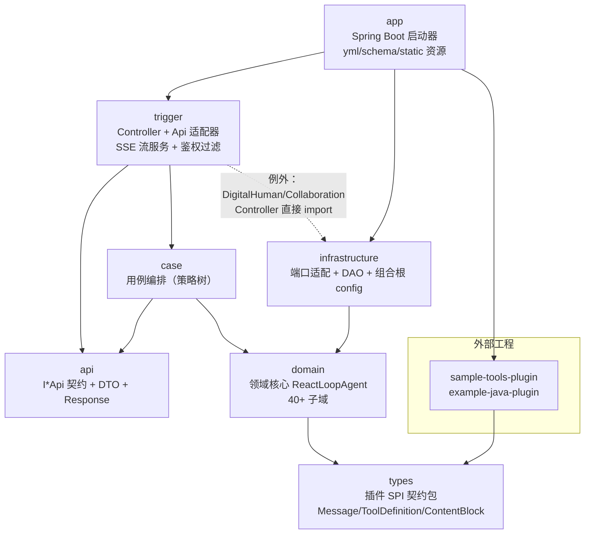
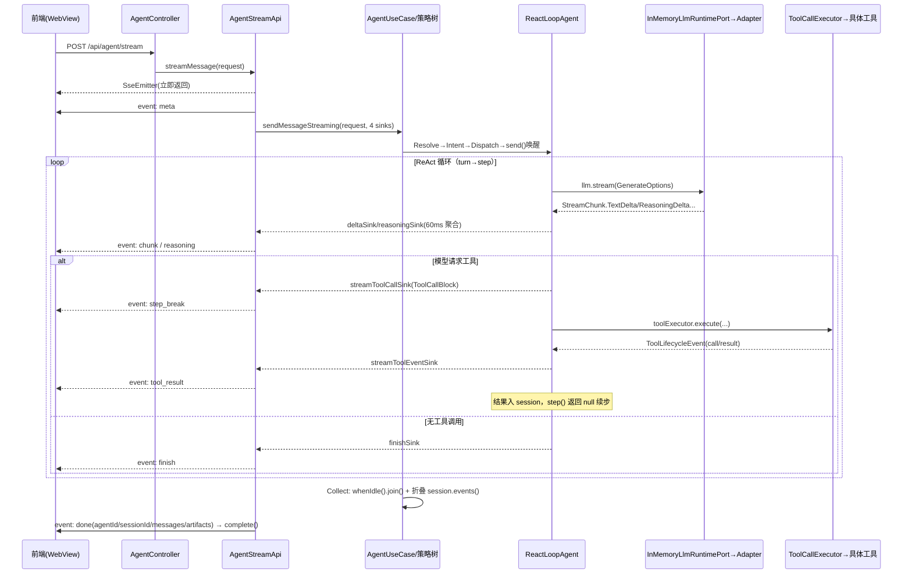

# 研究报告 01：模块依赖图与请求生命周期

- 研究对象：`vendors/deepseek-harness-java`（git submodule，固定于 `ff2d0a5`，commit message：`feat（0.1.8）：对话信息优化`，父 POM 版本号 `0.1.7`）
- 构建体系：Maven 多模块（无 Gradle），Java 17，Spring Boot 3.3.2
- 方法：以 `pom.xml` 依赖声明 + 源码 `import` 语句双重核实；关键链路逐文件读完整实现
- 所有路径相对 `vendors/deepseek-harness-java/`

---

## 0. 核心结论摘要

1. 项目是标准 DDD 六层 + 插件契约包的结构，共 9 个 Maven 模块：`api`（接口契约）、`types`（插件 SPI 契约包）、`domain`（领域核心，40+ 子域包）、`case`（用例编排，策略树模式）、`infrastructure`（端口适配器 + MyBatis DAO + 组合根配置）、`trigger`（HTTP 控制器 + API 适配器 + SSE 流服务）、`app`（Spring Boot 启动器）以及 `plugins/sample-tools-plugin`、`plugins/deepseek-harness-plugin-archetype` 两个插件模块。
2. 依赖主干严格单向：`app → trigger → case → domain → types`，`infrastructure → domain`，`api` 零内部依赖、被 trigger/case 依赖。组合根在 `infrastructure/config/`（用 Spring `@Bean` 装配纯 Java 的 domain 对象），启动入口在 `app`。
3. 存在三处例外/意外依赖：(a) `trigger` 的两个控制器直接 import `infrastructure.digitalhuman` 服务实现，绕过 api/case 接口；(b) `case` 层大量直接使用 `api` 层 DTO，与 `IAgentUseCase` javadoc 中"case 层自有 Command/Result、不直接依赖 API DTO"的声明矛盾；(c) `types` 模块与 `domain` 共享同一个包命名空间 `cn.xiaofuge.deepseek.harness.domain.model/spi`（跨 artifact 的 split package）。
4. 一条对话请求的完整链路是：`AgentController → AgentApi → AgentUseCase → AgentMessageFactory（策略树 Resolve→Intent→Dispatch→Collect）→ ReactLoopAgent（ReAct 循环：turn→step）→ InMemoryLlmRuntimePort → ProtocolRoutingAdapter → DeepSeekAdapter/OpenAiCompatibleAdapter/AnthropicAdapter（HTTP SSE 调 LLM）`，工具调用经 `ToolCallExecutor`（审批门禁→Hook→并行/串行调度→超时）落到具体 Tool（shell/fs/web/plugin/MCP）。
5. 会话采用事件溯源：`ReactLoopAgent` 每一步向内存 WAL `SessionLog` 追加事件，`PersistingSessionLog` 异步镜像到 `ISessionEventStore` → `JdbcSessionEventStore`（MyBatis → MySQL/H2）；Agent 实例丢失后可从事件日志恢复会话（`AgentResolveNode.findPersistedSession`）。
6. 流式（SSE）路径与非流式共用同一棵策略树，差异仅在于把 4 个回调 sink（delta/reasoning/toolCall/finish）经 `AgentMessageDynamicContext.attachSinks()` 挂到 `ReactLoopAgent` 的 volatile 字段上，由 `AgentStreamApi` 聚合成 `meta/chunk/reasoning/step_break/tool_result/finish/done/error` 事件帧，并带 15s keepalive 心跳。
7. 横切关注点全部有明确落点：配置在 `application.yml + harness.yml`（Spring `config.import`）；鉴权是 `ApiKeyAuthInterceptor`（`harness.auth.api-keys` 为空即全放行）；异常无全局 Handler，逐层 try/catch 并最终收敛为 `Response{00000/40000/50000}` 或 SSE `error/done.error` 事件；日志用 slf4j，全链路带 `[UseCase]/[Resolve]/[turn]/[step]/[Tool]/[SSE]` 等前缀标签。

---

## 1. 模块清单与职责

依据：根 `pom.xml#modules`（`pom.xml:14-24`，注意 `<modules>` 里没有 `plugins/example-java-plugin`，该目录虽有 `pom.xml` 但不参与构建）。

| 模块（artifactId） | 顶层包 | 职责 | 关键类/抽象 | 内部依赖（pom 声明） |
|---|---|---|---|---|
| `deepseek-harness-java-api` | `cn.xiaofuge.deepseek.harness.api` | 对外 API 契约：23 个 `I*Api` 接口 + 全部 DTO + 统一响应包装 + 流式接口标记 | `IAgentApi`、`api/stream/IAgentStreamApi`、`api/gateway/IGatewayStreamApi`、`api/response/Response`、`api/dto/AgentMessageRequestDTO` | 无内部依赖（仅 spring-context/webmvc/jackson） |
| `deepseek-harness-java-types` | `cn.xiaofuge.deepseek.harness.domain.model.{entity,valobj}`、`cn.xiaofuge.deepseek.harness.domain.spi` | **插件开发契约包**（pom description："外部插件工程只需依赖此包即可开发"）：工具 SPI、内容块值对象 | `spi/JavaHarnessPlugin`、`spi/AbstractHarnessPlugin`、`model/entity/ToolDefinition`、`model/entity/AbstractTool`、`model/entity/Message`、`model/valobj/ContentBlock` 族 | 仅 slf4j-api |
| `deepseek-harness-java-domain` | `cn.xiaofuge.deepseek.harness.domain` | 领域核心，40+ 子域（agent/llm/tool/session/plugin/runtime/task/goal/skill/hooks/sandbox/terminal/…），每域按 `model/valobj` + `service` + `adapter/port`（或 `adapter/repository`）组织，纯 Java 零 Spring 注解（spring-context/jackson 均为 provided） | `agent/service/run/ReactLoopAgent`（核心驱动器）、`agent/service/run/AgentRunFactory`、`agent/contract/inbound/AgentRunLifecycle`、`llm/adapter/port/ILlmRuntimePort`、`tool/adapter/ToolRegistry`、`tool/service/ToolCallExecutor`、`session/event/model/entity/SessionLog` | types |
| `deepseek-harness-java-case` | `cn.xiaofuge.deepseek.harness.cases` | 用例编排层：每个用例一棵策略树（`orchestration/CasePipeline` + `StrategyHandler`），按业务域分子包（agent/session/plugin/task/approval/goal/terminal/workflow/runtime/question/config） | `agent/AgentUseCase`、`agent/factory/AgentMessageFactory`、`agent/node/Agent{Resolve,Intent,Dispatch,Collect}Node`、`orchestration/CasePipeline` | domain、api |
| `deepseek-harness-java-infrastructure` | `cn.xiaofuge.deepseek.harness.infrastructure` | 端口适配层 + 组合根：实现 domain 的 `*Port`/`*Store`/`*Repository` 接口；LLM 协议适配器；MyBatis `dao/`；`config/` 是全工程 Spring 装配中心 | `adapter/llm/InMemoryLlmRuntimePort`、`adapter/llm/ProtocolRoutingAdapter`、`adapter/llm/{deepseek,openai,anthropic}/*Adapter`、`adapter/eventstore/JdbcSessionEventStore`、`adapter/shell/LocalShellExecutor`、`adapter/fs/LocalFsService`、`config/AgentRunBeanConfig`、`config/HarnessApplicationConfig` | domain |
| `deepseek-harness-java-trigger` | `cn.xiaofuge.deepseek.harness.trigger` | 触发层：HTTP 控制器（`http/command`、`http/query` + 独立 Controller）、API 适配器（`service/`，实现 api 接口并调用 case 用例）、SSE 流服务（`service/stream/`）、鉴权过滤器（`filter/`） | `http/AgentController`、`service/AgentApi`、`service/stream/AgentStreamApi`、`filter/ApiKeyAuthInterceptor`、`filter/WebMvcConfig` | api、case、infrastructure |
| `deepseek-harness-java-app` | `cn.xiaofuge.deepseek.harness.app` | Spring Boot 启动模块（fat jar，`spring-boot-maven-plugin repackage`）：`Application` + 启动 Runner + 全部资源文件（yml、schema.sql、static Web 控制台） | `app/Application`（`@SpringBootApplication(scanBasePackages="cn.xiaofuge.deepseek.harness")`）、`app/model/ModelSyncRunner`、`app/plugin/PresetPluginLoader` | trigger、infrastructure、`sample-tools-plugin` |
| `plugins/sample-tools-plugin` | `cn.walioffice.plugin.sample` | 示例 JAVA_NATIVE 插件（天气查询 + 文件摘要两个工具），构建时被复制到 `./plugins/` 供 preset 预装 | `SampleToolsPlugin extends AbstractHarnessPlugin` | types（`deepseek-harness-java-types`） |
| `plugins/deepseek-harness-plugin-archetype` | — | 插件工程脚手架（Maven archetype） | `archetype-resources/` | — |
| `plugins/example-java-plugin`（**不在** `<modules>`） | `com.example.plugin` | 未参与构建的演示代码 | `ExampleJavaPlugin` | types |

---

## 2. 模块依赖图

### 2.1 构建文件声明（pom.xml `<dependencies>`）

```text
deepseek-harness-java-api          → （无内部依赖）
deepseek-harness-java-types        → （无内部依赖）
deepseek-harness-java-domain       → types
deepseek-harness-java-case         → domain, api
deepseek-harness-java-infrastructure → domain
deepseek-harness-java-trigger      → api, case, infrastructure
deepseek-harness-java-app          → trigger, infrastructure, sample-tools-plugin
plugins/sample-tools-plugin        → （types 之外的插件契约，见其 pom）
```

### 2.2 import 语句核实结果（`grep -rh "^import cn.xiaofuge"` 全量扫描）

- `api` → 仅引用自身包。✅ 与 pom 一致。
- `types` → 仅引用自身 `domain.model.*` / `domain.spi.*`（同模块跨包 import，因 split package）。✅
- `domain` → 只 import 自身 + `types` 提供的 `domain.model.entity.Message` 等（例：`ReactLoopAgent.java:14-16` import 的 `Message/MessageSource/ContentBlock` 实际位于 types 模块源码树）。✅ 无反向依赖。
- `case` → 大量 import `api.dto.*`（50+ 处）+ `domain.**`。⚠️ `IAgentUseCase.java:11` 声称"用例位于 Case 层，使用 case 层自有 Command/Result 对象，不直接依赖 API 层 DTO"，**实际代码相反**（`AgentUseCase.java:3-5` 直接 import `AgentMessageRequestDTO/AgentMessageResponseDTO`）。
- `infrastructure` → 只 import `domain.**`（含 types 包）。✅ 无反向依赖。
- `trigger` → `api.**`（契约）、`cases.**`（用例）、`domain.**`（个别 service 直接引用，如 `WorkspaceRegistryService`）、**`infrastructure.**` 两处例外**：
  - `trigger/http/DigitalHumanController.java:4` → `infrastructure.digitalhuman.DigitalHumanService`
  - `trigger/http/CollaborationController.java:4` → `infrastructure.digitalhuman.CollaborationService`
- `app` → `trigger.http` 无；import `infrastructure.config.HarnessExtensionsProperties`、`api.dto`、`domain.plugin.**`、`domain.runtime.setting` 等。

### 2.3 依赖图（mermaid）



### 2.4 分层规律

- **依赖方向整体是"离心式"**：`domain`（+`types`）处于圆心零反向依赖；`api` 是独立契约片；`case/infrastructure` 都只踩 domain；`trigger` 把三者粘起来；`app` 只做启动与装配扫描。
- **真正的"组合根"不在 app 而在 infrastructure**：`config/AgentRunBeanConfig.java#agentRunFactory()`（L210-285）与 `config/HarnessApplicationConfig.java#llmRuntimePort()`（L106-122）用 `@Bean` 把纯 Java 的 domain 对象（`AgentRunFactory`、`InMemoryLlmRuntimePort`、`ScopedSystemPromptAssembler`、`BasicCompactionEngine`）装配成图；`app/Application.java` 仅 `scanBasePackages = "cn.xiaofuge.deepseek.harness"` 全包扫描 + `@MapperScan("...infrastructure.dao")`。
- **接口/实现分离的两种形态**：(1) api 接口由 trigger 实现（`AgentApi implements IAgentApi`）；(2) domain 端口由 infrastructure 实现（`JdbcSessionEventStore implements ISessionEventStore`、`LocalShellExecutor implements IShellExecutor`）。

---

## 3. 一条对话请求的完整调用链路

两条入口：`POST /api/agent/message`（非流式）与 `POST /api/agent/stream`（SSE 流式），另有 `POST /api/gateway/stream`（数字人网关，见 3.4）。

### 3.0 请求契约

`api/dto/AgentMessageRequestDTO.java`（record，L12-22）：`agentId`（必填）、`channelCode`、`maxTokens`、`cwd`、`message`（必填）、`images`（data URL/裸 base64）、`approvalMode`（REQUEST_APPROVAL/AUTO_APPROVE/FULL_OPEN）、`reasoningEffort`、`sandboxRoots`。

### 3.1 非流式链路逐跳明细（POST /api/agent/message）

| # | 跳 | 位置（类#方法） | 做什么 |
|---|---|---|---|
| 1 | HTTP 入口 | `trigger/http/AgentController.java#sendMessage()` L30-32 | `@PostMapping("/message")`，直接委托 `IAgentApi` |
| 2 | API 适配器 | `trigger/service/AgentApi.java#sendMessage()` L51-53 → `execute()` L104-112 | 调用 case 用例并把异常收敛为 `Response`（00000/40000/50000） |
| 3 | 用例门面 | `cases/agent/AgentUseCase.java#sendMessage()` L43-47 | 取 `AgentMessageFactory.pipeline()` 并 `execute(request)` |
| 4 | 策略树构建 | `cases/agent/factory/AgentMessageFactory.java#pipeline()` L37-39；`cases/orchestration/CasePipeline.java#execute()` L51-68 | 根节点固定为 `AgentResolveNode`；`CasePipeline.execute` 负责创建/关闭上下文（`AgentMessageDynamicContext implements AutoCloseable`） |
| 5 | Resolve 节点 | `cases/agent/node/AgentResolveNode.java#doApply()` L61-115 | (a) `request.sandboxRoots()+cwd` 写入 `SandboxExtraRootsRegistry`（L66-75）；(b) `agentFactory.get()` 命中则复用（流式互斥检查 L81-86）；(c) 未命中则 `findPersistedSession()` 从事件日志恢复（L93-97、L138-160）或 `agentFactory.create()`（L101）；(d) `AgentModelSettingResolver.resolve()` 生成 `AgentOptions`（L170-174，优先级：请求显式值→数据库默认→application.yml 兜底） |
| 6 | 工厂建 Agent | `domain/agent/service/run/AgentRunFactory.java#create()` L105-110 + `wireAgent()` L154-207 | 组装 `Inbox`、per-Agent `ToolRegistry`（`AgentToolCatalog.createRegistry`）、`ToolCallExecutor`（maxParallel=10、toolTimeoutMs）、审批门禁 `MatrixRuntimeApprovalGate`，最后 new `ReactLoopAgent` 放入 `liveAgents` 缓存 |
| 7 | Intent 节点 | `cases/agent/node/AgentIntentNode.java#doApply()` L68-77（`classify()` L101-136） | 纯正则规则把消息归类 CHAT / CODE_QUESTION / TASK_EXECUTION / CLARIFICATION |
| 8 | Dispatch 节点 | `cases/agent/node/AgentDispatchNode.java#doApply()` L51-69 | `prepareMessageText()` 按意图改写消息（目录类任务生成 ls 指令提示 L177-199；`@插件` 提及转指令 L152-169）；图片附件转 `ImageBlock`（L76-111）；`Message.createUser()` 后 `agent.send(userMessage, InboxTarget.NEXT_TURN, true)`（L66） |
| 9 | Inbox 投递/唤醒 | `domain/agent/service/run/ReactLoopAgent.java#send()` L294-308 → `wakeDriver()` L320-333 → `kick()` L343-377 | 消息入 Inbox；Idle 态切 `Phase.Running` 并在缓存线程池中异步启动驱动循环 |
| 10 | turn 循环 | `ReactLoopAgent.java#turn()` L389-512 | `session.append(turnStart)` → `runCompaction()`（L514-526，token 压力超阈值时用 `BasicCompactionEngine` 压缩）→ 循环 `inbox.claim` + `step()`；`MAX_STEPS_PER_TURN=50`、`MAX_TOKEN_CONTINUATIONS=4`；`step()` 返回 `null` 表示"工具执行完，继续下一步"（midTurnContinuation，L459-463） |
| 11 | step：组装请求 | `ReactLoopAgent.java#step()` L538-566 + `buildRequest()` L818-848 | `systemPromptAssembler.assemble()`（实现在 `domain/agent/service/ScopedSystemPromptAssembler.java#assemble()` L140+；人设/工具规则文案硬编码在 `infrastructure/config/AgentRunBeanConfig.java#systemPromptAssembler()` L98-152）；`session.deriveMessages()` → `truncateToBudget()`（128K 预算估算裁剪）→ `GenerateOptions`（含 provider/model/baseUrl/apiKey/protocol） |
| 12 | step：LLM 流式调用 | `ReactLoopAgent.java` L568-654 订阅 `llm.stream(generateOptions)` | 增量 `StreamChunk.TextDelta/ReasoningDelta` → `BlockAssembler` + `session.appendBatch(chunkEvents)`（L666）+ `streamDeltaSink/streamReasoningSink` 回调（L617-634） |
| 13 | LLM 端口路由 | `infrastructure/adapter/llm/InMemoryLlmRuntimePort.java#stream()` L164-217 | 按 `options.provider()` 查已注册 `LlmAdapter`；无适配器时发 `StreamChunk.Finish(Error)`；DeepSeek 有重试策略走 `retryingStream()`（仅在未吐出任何内容前重试，L218-229） |
| 14 | 协议路由 | `infrastructure/adapter/llm/ProtocolRoutingAdapter.java#stream()` L56-58 + `delegate()` L79-84 | 按请求携带的 `protocol`（模型设置里配的）委托 `LlmAdapterFactory.createForProtocol()`：`OPENAI/OLLAMA → OpenAiCompatibleAdapter`、`ANTHROPIC → AnthropicAdapter`（`LlmAdapterFactory.java#L65-75`）；`DeepSeekAdapter` 是独立默认 Bean（`HarnessApplicationConfig.java` L117 起） |
| 15 | 真实 HTTP 外呼 | `infrastructure/adapter/llm/deepseek/DeepSeekAdapter.java#doStream()` L181-238 | `java.net.http.HttpClient` POST `{baseUrl}/chat/completions`（`OpenAiCompatibleUriResolver.resolveChatCompletionsUri`），`Accept: text/event-stream`，`Authorization: Bearer <key>`，附带 `x-deepseek-harness-session-id` 头；`translateSse()` 解析 SSE 分片发布 `StreamChunk`；空流时降级 `doNonStreamFallback()`（L247+，`stream:false` 一次性请求） |
| 16 | step：工具调用判定 | `ReactLoopAgent.java` L696-760 | `FinishReason.Error` → 写错误 assistant 消息并返回 `TurnEndReason.Error`；无 `ToolCallBlock` → 跑 `streamFinishSink` 并返回 `Completed`；有工具调用 → 先推 `streamToolCallSink`（L747-752）再 `toolExecutor.execute(...)`（L754），返回 `null` 续步 |
| 17 | 工具执行循环 | `domain/tool/service/ToolCallExecutor.java#execute()` L201-239 → `runGroup()` L289-560 | 参数解析（`JacksonToolArgumentsParser`）→ 按 `ToolExecutionMode` 分组（PARALLEL 并行 / 其余串行）→ 每个调用依次过：PRE_TOOL_USE Hook（`shouldBlock()` L169-178）→ 审批门禁（`checkApproval()` L150-162，DENY 时写合成失败结果）→ `appendToolCall` 事件 → 派发到 `TOOL_WORKER` 池并限时等待（默认 `DEFAULT_TOOL_TIMEOUT_MS=300_000`，超时判 `TOOL_TIMEOUT`）→ `commitOne()` L587-651（`finalizeContent`、延迟上下文合并、产物登记、`appendToolResult` 事件、生命周期回调 `notifyLifecycle`） |
| 18 | 工具实现（外呼） | 例：`domain/tool/shell/ShellExecuteTool.java` → `infrastructure/adapter/shell/LocalShellExecutor.java#execute()` L31+（`ProcessBuilder`）；fs 工具 → `IFsPort` → `LocalFsService`（经 `CwdResolvingFsPort` 解析相对路径）；插件工具 → `PluginToolDefinition`（`domain/tool/plugin/PluginToolBridgeService.java#L71-72` 注册进 ToolRegistry）；MCP 工具 → `McpToolAdapter`（`domain/tool/mcp/McpBootstrap.java#L76`） | 工具全集在 `domain/agent/service/run/tool/AgentToolCatalog.java#createRegistry()` L114-200：TodoWrite/AskUser/ExitPlanMode/ShellExecute/FsRead/FsWrite/FsSearch/StrReplaceEditor/FsGrep/FsReadImage/FsEdit/PluginStatus/WebSearch/WebFetch/Lsp/Terminal×5/Job×4/Goal×3/Schedule×3/SessionSearch/Skill/Subagent |
| 19 | Collect 节点 | `cases/agent/node/AgentCollectNode.java#doApply()` L47-123 | `agent.whenIdle().join()` 等待回合结束（异常收口为 `turnError` L54-62）；遍历 `session.events()` 把 UserMessage/AssistantMessage/ToolCall/ToolResult 折叠为消息列表（ToolCall/ToolResult 按 callId 配对 L79-108）；`drainWrittenArtifacts()` 取本回合写文件产物；组装 `AgentMessageResponseDTO(agentId, sessionId, status, messages, artifacts, error)` |
| 20 | 响应包装 | `trigger/service/AgentApi.java#execute()` L104-112 → `AgentController` | `Response.success(data)` 返回 JSON |

### 3.2 SSE 流式链路（POST /api/agent/stream）

前 8 跳与 3.1 相同，差异从 trigger 层开始：

| # | 跳 | 位置 | 说明 |
|---|---|---|---|
| S1 | SSE 入口 | `trigger/http/AgentController.java#streamMessage()` L34-37 | `produces = TEXT_EVENT_STREAM_VALUE`，返回 `SseEmitter` |
| S2 | 流服务 | `trigger/service/stream/AgentStreamApi.java#sendMessageStreaming()` L61-73 | `SseEmitter` 超时设 0（不设硬超时，L28-30）；投递到缓存线程池 `sseExecutor`（L48-52） |
| S3 | 事件泵 | `AgentStreamApi.java#emitAgentStream()` L75-117 | 发 `meta` 事件 → 构建 `DeltaBatch`（60ms 增量聚合，L82-85）→ 启动 15s keepalive 心跳（SSE comment，`startHeartbeat()` L124-135）→ 以 4 个 sink 调 `agentApi.sendMessageStreaming(...)` → 收尾 flush 后发 `done` |
| S4 | sink 下传 | `trigger/service/AgentApi.java#sendMessageStreaming()` L62-86（phase→status 映射）→ `AgentUseCase.java#sendMessageStreaming()` L59-68 → `AgentMessageFactory.java#streamingPipeline()` L44-62 | 4 个 sink（delta/reasoning/toolCall/finish）塞进 `AgentMessageDynamicContext` |
| S5 | sink 挂载 | `cases/agent/factory/AgentMessageDynamicContext.java#attachSinks()` L94-121 → `ReactLoopAgent.java#setStreamDeltaSink/setStreamReasoningSink/setStreamToolCallSink/setStreamToolEventSink/setStreamFinishSink` L221-246 | Agent 的 sink 是 volatile 单实例字段——这就是 Resolve 节点做"流式互斥"的原因（同 Agent 运行中不接受第二条流） |
| S6 | 运行期推送 | 文本/推理增量：`ReactLoopAgent.java` L617-634；工具 call/result 事件：`ToolCallExecutor.java#notifyLifecycle()` L736-743 → `ReactLoopAgent.java#onToolLifecycleEvent()` L248-252；无工具调用收尾：`finishSink.run()` L735-738 | 每个回调被 `AgentStreamApi` 转成 SSE 帧 |
| S7 | SSE 事件协议 | `AgentStreamApi.java` `sendDelta/sendReasoning/sendToolCall/sendFinish/sendDone/sendError` L137-271 | 事件名：`meta`、`chunk`、`reasoning`、`step_break`（工具 call 相位）、`tool_result`（result 相位）、`finish`、`done`（只回传当前回合消息 + artifacts + 可选 error，`DonePayloads.currentTurnMessages` 做瘦身）、`error` |

**SSE 序列图**



### 3.3 工具调用循环（tool-call loop）专项

- 驱动逻辑在 `ReactLoopAgent.turn()`/`step()`：`step()` 返回 `null`（工具执行完毕）时 `turn()` 置 `midTurnContinuation=true` 继续下一步，**只有模型不再请求工具（`FinishReason` 正常且无 `ToolCallBlock`）才返回 `TurnEndReason.Completed`**（`ReactLoopAgent.java` L732-740、L758-760）。
- 一轮工具批次的调度细节（`ToolCallExecutor.runGroup()`）：`ToolExecutionMode.PARALLEL` 的调用按 `maxParallel=10` 在 `TOOL_WORKER` 池并发，但**结果严格按派发顺序提交**（`commitReady()` L568-579，保证 tool_call/tool_result 在事件日志中成对且有序）；取消时未派发的调用写合成失败 `appendSkippedToolCall()`（L710-717），避免事件日志出现悬挂 call。
- 上下文预算防护：单 turn 步数上限 50（L399）、MaxTokens 受控续写上限 4 次（L400、L471-480）、上下文 128K 估算裁剪（L827-831）、工具结果文本截断 8192 字符（`flattenToolResult()` L719-734、`AgentCollectNode` L106）。

### 3.4 其他对话入口

- `POST /api/gateway/stream`：`trigger/http/GatewayStreamController.java#stream()` → `trigger/service/stream/GatewayStreamApi.java#stream()` L69+，按 `requestType` 分派 `streamAgent`/`streamWorkflow`（L109-110），供数字人/A2A 协作场景复用同一套 agent 流。
- `POST /api/harness/tasks/submit`：`trigger/http/HarnessTaskController.java#submitTask()` → `IHarnessTaskApi` → `cases/task/submit/`（异步任务队列路径，非对话直连）。

---

## 4. 请求生命周期中的横切关注点

### 4.1 配置加载

- `app/src/main/resources/application.yml`：`server.port=8090`；MySQL 数据源（默认 `jdbc:mysql://192.168.1.108:13306/...`）；`spring.config.import` 引入 `optional:classpath:harness.yml` 与 `optional:file:./harness.yml`（L33-38）——**业务配置全部集中在 `harness.yml`**。
- `harness.yml`：`harness.llm.deepseek.{base-url,api-key,default-model}`（环境变量 `LLM_BASE_URL/LLM_API_KEY/LLM_DEFAULT_MODEL` 可覆盖，默认 `http://127.0.0.1:8777/v1`）、`harness.approval.{required-tools,runtime-timeout-ms}`、`harness.sandbox.default-mode=WORKSPACE_WRITE`、`harness.agent.{default-cwd,tool-timeout-ms,compaction}`、`harness.auth.api-keys`、`harness.extensions.{skills,mcp,plugins.preset}`。
- 注入方式：infrastructure 组合根用 `@Value` 读取（`AgentRunBeanConfig.java` L76-77、L161、L222、L239；`AgentModelSettingResolver.java` L30-33），三级兜底：**请求显式值 → 数据库模型设置（`IHarnessModelSettingDao`，Web 控制台可改）→ yml/环境变量**（`AgentResolveNode.buildAgentOptions()` javadoc L164-168 明确此优先级）。
- 启动 Runner：`app/model/ModelSyncRunner`（同步模型设置）、`app/model/SchemaMigrationRunner`、`app/plugin/PresetPluginLoader`（按 `harness.extensions.plugins.preset` 预装/启用插件，`installPreset()` L90+）。

### 4.2 鉴权

- 唯一防线是 `trigger/filter/ApiKeyAuthInterceptor.java#preHandle()`（L32-98），经 `WebMvcConfig.java#addInterceptors()` 注册到 `/**`：
  - `harness.auth.api-keys` 为空 → 全放行（本地开发模式，L61-67）；
  - 否则校验 `X-API-Key` 头或 `Authorization: Bearer`，失败返回 401 JSON；
  - 静态资源、`/actuator`、`/.well-known/`、OPTIONS 预检放行（L38、L54-58）。
- CORS 在 `WebMvcConfig.java#addCorsMappings()` L41-49 全放开（注释说明桌面 Tauri WebView 直连 + SSE 依赖）。
- **没有** Spring Security；应用层的"审批"（见 4.5）是业务级授权，与 HTTP 鉴权分离。

### 4.3 异常处理

无 `@ControllerAdvice` 全局处理器，采用**逐层收口**：

| 层 | 收口点 | 方式 |
|---|---|---|
| trigger（非流式） | `AgentApi.java#execute()` L104-112（所有 `*Api` 同构） | `IllegalArgumentException → Response.invalidArgument(40000)`；`RuntimeException → Response.internalError(50000)` |
| trigger（流式） | `AgentStreamApi.java#sendError()` L253-271 | catch 后发 SSE `error` 事件并 `completeWithError` |
| case | `CasePipeline.java#execute()` L51-68 | 受检异常包成 `CaseExecutionException`；`AutoCloseable` 上下文保证清理 |
| domain（回合级） | `ReactLoopAgent.java#turn()` L505-511 | 未捕获异常 → `TurnEndReason.Error` 落事件日志；驱动线程死亡由 `AgentCollectNode.java` L51-62 捕获 `whenIdle()` 异常并转成响应 `error` 字段 |
| domain（step 级） | `ReactLoopAgent.java#step()` L696-712 | `FinishReason.Error` 时若 assistant 消息为空则合成可见错误消息（防前端空白） |
| domain（工具级） | `ToolCallExecutor.java` 超时/异常/审批拒绝均产 `ToolExecutionResult.Failure` | 错误作为工具结果回灌模型，不中断回合 |
| infrastructure（LLM） | `InMemoryLlmRuntimePort.java` L200-208 | 适配器异常包装为 `StreamChunk.Finish(FinishReason.Error)` |

### 4.4 日志

- slf4j-api + Spring Boot 默认后端；`application.yml` 设 `logging.level.cn.xiaofuge.deepseek.harness: info`。
- 全链路使用方括号前缀标签，可直接按标签 grep 追踪一次请求：`[UseCase]`（AgentUseCase）→ `[Resolve]/[Intent]/[Dispatch]/[Collect]`（四个节点）→ `[SSE]`（AgentStreamApi）→ `[kick]/[turn]/[step]/[cancel]/[Compaction]`（ReactLoopAgent）→ `[Tool]`（ToolCallExecutor）→ `[GatewayStream]`（网关流）。step/turn 日志还带耗时统计（`ReactLoopAgent.java` L539-551、L733-735）。

### 4.5 审批与沙箱（对话内安全切面）

- 每个请求可携带 `approvalMode`（`AgentMessageRequestDTO`），经 `ApprovalModeVO.from()` 解析后 `agentFactory.configureApprovalMode()` 设置到 per-Agent 的 `MatrixRuntimeApprovalGate`（`AgentRunFactory.java` L123-128、L176-185）。
- 需审批工具（`harness.approval.required-tools`: shell_execute、fs_write、plugin.run、subprocess.spawn）在 `ToolCallExecutor.checkApproval()` 被拦截，经 `RuntimeApprovalGateway`（`@Primary` 的 `AggregatingRuntimeApprovalGateway`，本地 Broker + 远端数字人端点聚合，`AgentRunBeanConfig.java` L171-181）等待人工裁决，超时 `runtime-timeout-ms=600000`。
- 沙箱：`ApprovalAwareFsPort`/`ApprovalAwareShellExecutor`（`domain/agent/service/run/tool/`）按 approvalMode 决定走受限还是不受限端口（`AgentToolCatalog.java` L119-124）；`sandboxRoots` 经 `SandboxExtraRootsRegistry` 动态放行工程目录（`AgentResolveNode.java` L63-75）；另有 `DangerousCommandGuard` 在 `ShellExecuteTool` 内拦截危险命令。

### 4.6 会话持久化（事件溯源）

- `ReactLoopAgent` 的每一次 turn/step/消息/工具调用都 `session.append(...)` 写入内存 WAL（`domain/session/event/model/entity/SessionLog`）。
- 生产装配为 `domain/agent/service/run/PersistingSessionLog.java`（注意：**类在 domain 模块但 javadoc L29 自称"位于 infrastructure 层"，注释已过时**）——覆写 `append/appendBatch`（L66-80），在单线程执行器中异步镜像到 `ISessionEventStore`，理由是避免远程 MySQL 延迟叠进流式收尾关键路径（L20-27）。
- 存储实现：`infrastructure/adapter/eventstore/JdbcSessionEventStore.java`（`append()` L109 → `dao.insert`，MyBatis `dao/ISessionEventRowDao.java` 注解 SQL）+ 备选 `JsonlSessionEventStore`；建表脚本 `app/src/main/resources/schema.sql`（`spring.sql.init.mode=always` 自动执行）。
- 恢复：Agent 实例丢失（重启）后，`AgentResolveNode.findPersistedSession()` 按 agentId 反查最近 header 并 `readAll` 重建 `PersistingSessionLog`（L138-160），实现"进程重启 ≠ 会话丢失"。

### 4.7 插件/扩展挂载

- 插件契约：外部工程只依赖 `types` 模块，实现 `JavaHarnessPlugin`（`types/.../domain/spi/JavaHarnessPlugin.java`，JAR 内含 `META-INF/plugin.yaml` + ServiceLoader 文件，隔离 ClassLoader 加载）。
- 插件工具在激活时经 `PluginToolBridgeService`（`domain/tool/plugin/`）注册进共享 `ToolRegistry`（L71-72），并在系统提示词里注册能力段落（L139+）；MCP 服务经 `McpBootstrap` 把远端工具包成 `McpToolAdapter` 注册（L76）。
- 命名规则：插件工具以 `plugin__<插件ID>__<工具名>` 暴露给模型（`AgentDispatchNode.appendPluginMentionInstruction()` L164-169 的 `@插件` 提及指令印证）。

---

## 5. 附录：构建与运行

```bash
# 构建（根目录）
mvn clean verify                  # 含测试
mvn clean package -DskipTests     # 快速打包（README:134）

# 产物：deepseek-harness-java-app/target/deepseek-harness-java-app-<ver>.jar
#   （spring-boot-maven-plugin repackage，finalName=deepseek-harness-java-app）

# 运行方式一：standalone（H2 文件库，零外部依赖）
java -jar deepseek-harness-java-app/target/deepseek-harness-java-app-*.jar \
  --spring.profiles.active=standalone
#   application-standalone.yml → jdbc:h2:file:./data/deepseek-harness-java;MODE=MySQL

# 运行方式二：默认 profile（MySQL，见 application.yml 数据源）
# 运行方式三：Docker Compose（Dockerfile 多阶段构建，ENTRYPOINT 带 standalone profile）

# 本地分发包
scripts/package-local.sh --zip    # 产出 dist/deepseek-harness-java-local + start.sh
```

要点：
- 构建时 `app` 模块的 `maven-dependency-plugin#copy-plugin-jars` 会把 `sample-tools-plugin` 复制为 `./plugins/sample-tools-plugin-1.0.0.jar`，与 `harness.yml` 的 preset `source-path` 对应，实现启动即预装。
- LLM 外呼默认指向 `http://127.0.0.1:8777/v1`（OpenAI 兼容协议），需以 `LLM_BASE_URL`/`LLM_API_KEY`/`LLM_DEFAULT_MODEL` 环境变量覆盖。
- 健康检查：`/actuator/health`（仅暴露 health/info）。
- Web 控制台为静态资源内嵌在 app 模块（`app/src/main/resources/static/`，`index.html + app.js`），对话页直接消费 SSE 协议（`meta/chunk/reasoning/step_break/tool_result/finish/done/error`）。

---

*报告基于 ff2d0a5 快照的源码静态分析；所有行号以该快照为准。*
