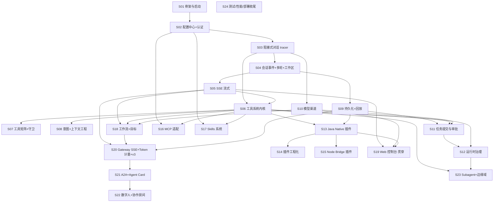

# 特性清单（feature inventory）：vendors/deepseek-harness-java @ ff2d0a5

> 研究对象：`vendors/deepseek-harness-java`（git submodule，固定在 `ff2d0a5`，只读）。
> 本文所有论断均来自一手来源（源码 / pom / README / release notes），引用格式为 `路径#方法名()`。
> 规模基线：7 个 Java 模块共 872 个 Java 文件、约 6.2 万行；另有约 5300 行前端静态资源与 9 个示例/脚手架插件工程。

---

## 0. 核心结论摘要

1. 这是一个**单实例 Agent Harness 运行时**：对话主线（ReAct 循环 + 工具 + SSE 流式）与任务主线（提交 → 权限 → 审批 → 执行）两条业务链，外加插件/扩展生态（Java SPI 插件、Node Bridge、MCP、Skills）。
2. 共识别出 **24 个可增量交付切片**：2 个地基 + 6 个对话主线 + 3 个平台底座（持久化/模型渠道/任务审批）+ 5 个扩展生态 + 2 个平台功能 + 4 个协作协议与运行时增强 + 2 个收尾切片。
3. 推荐构建顺序一句话：**骨架 → 配置 → 阻塞对话（tracer）→ 会话事件/SSE → 工具内核 → 意图/压缩 → 持久化‖模型渠道 → 任务审批 → 运行时治理 → Java 插件 → {插件工程化‖Node Bridge‖MCP‖Skills} → 工作流/目标 → Web 控制台 → Gateway SSE/Token 计量 → A2A → 数字人协作 → 边缘域 → 测试部署收尾**。
4. 版本演进（release notes 佐证）即天然切片序：v0.1.2 基线 → v0.1.3 配置/MCP/Skills → v0.1.4 插件工程化 → v0.1.5 插件安全 → v0.1.6 模型渠道 → v0.1.7 会话 v3/Gateway SSE/数字人/A2A → v0.1.8 对话信息优化。

---

## 1. 能力总览（用户可感知的全部功能）

以下每一项都有代码入口佐证，不含臆造。

### 1.1 Agent 对话主线

| # | 能力 | 入口 / 关键类 |
| --- | --- | --- |
| A1 | 阻塞式对话 | `POST /api/agent/message` → `deepseek-harness-java-trigger/.../http/AgentController.java` → `cases/agent/AgentUseCase.java#apply()` |
| A2 | SSE 流式对话（meta/chunk/step_break/done/error + keepalive 心跳） | `POST /api/agent/stream` → `trigger/service/stream/AgentStreamApi.java#sendMessageStreaming()`；`ReactLoopAgent.java#setStreamDeltaSink()` |
| A3 | Agent 状态查询 / 取消 | `GET /api/agent/{agentId}/status`、`POST /api/agent/{agentId}/cancel`（`AgentController`）；`ReactLoopAgent.java#cancel()`（AtomicBoolean + 100ms 轮询） |
| A4 | agentId 会话复用与消息投影 | `cases/agent/node/AgentResolveNode.java`、`AgentCollectNode.java`（按 callId 合并 ToolCall/ToolResult） |
| A5 | ReAct 循环（单 turn 上限 50 步、max_tokens 受控续写、工具后续步） | `domain/agent/service/run/ReactLoopAgent.java#send()`；`midTurnContinuation` 标志 |
| A6 | Phase 状态机（Idle/Running/Maintenance） | `domain/agent/model/entity/Phase.java` |
| A7 | 意图识别（纯正则，无额外模型调用） | `cases/agent/node/AgentIntentNode.java#classify()` → CHAT / CODE_QUESTION / TASK_EXECUTION / CLARIFICATION；`[no-tools]` 前缀跳过工具 |
| A8 | 会话压缩（保留最近 1/4，其余 LLM 总结） | `domain/agent/service/compaction/BasicCompactionEngine.java` |
| A9 | 系统提示词装配 | `domain/agent/service/SystemPromptAssembler.java`、`ScopedSystemPromptAssembler.java` |
| A10 | 运行时用户提问（ask_user_question 闭环） | `domain/agent/service/ask/AskUserTool.java` + `POST /api/harness/questions/runtime/{id}/answer`（`RuntimeQuestionController`） |
| A11 | 运行时审批（Agent 运行中高风险动作拦截） | `domain/agent/service/run/RuntimeApprovalBroker.java` + `POST /api/harness/approvals/runtime/{id}/resolve`（`RuntimeApprovalController`）。**待核实**：README 自述默认 `approvalBroker=null` 未启用，实际默认行为以 `infrastructure/config/AgentRunBeanConfig.java` 装配为准 |

### 1.2 工具系统（Agent 可调用的全部内置工具）

注册清单见 `domain/agent/service/run/tool/AgentToolCatalog.java`（`AgentToolCatalogTest` 佐证）：

| 类别 | 工具 | 实现类 |
| --- | --- | --- |
| 待办 | todo_write | `domain/todo/service/TodoWriteTool.java` |
| 交互 | ask_user_question | `domain/agent/service/ask/AskUserTool.java` |
| 计划 | exit_plan_mode | `domain/plan`（`ExitPlanModeTool`，AgentToolCatalog#L139 注册） |
| Shell | shell_execute | `domain/tool/shell/ShellExecuteTool.java` + `infrastructure/adapter/shell/LocalShellExecutor.java`（`/bin/sh -c`） |
| 文件 | fs_read / fs_write / fs_search / fs_grep / fs_edit / fs_read_image / str_replace_editor | `domain/tool/fs/`（`FsReadTool`、`FsWriteTool`、`FsSearchTool`、`FsGrepTool`、`FsEditTool`、`FsReadImageTool`、`StrReplaceEditorTool`） |
| 插件观测 | plugin_status | `domain/tool/plugin/PluginStatusTool.java` |
| 网络 | web_search / web_fetch | `domain/tool/web/WebSearchTool.java`、`WebFetchTool.java` |
| LSP | lsp 工具（条件注册） | `domain/tool/lsp/LspTool.java` |
| 终端 | terminal_open/send/read/close/list_sessions（条件注册） | `domain/tool/terminal/TerminalTools.java`（内部类 Open/Send/Read/Close/ListSessions） |
| 后台作业 | job_run / job_list / job_output / job_kill（条件注册） | `domain/tool/jobs/JobRunTool.java` 等 4 个 |
| 目标 | goal_get/create/update（条件注册） | `domain/tool/goal/GoalTools.java` |
| 调度 | schedule_create/list/delete（条件注册） | `domain/tool/schedule/ScheduleTools.java` |
| 会话 | session_search | `domain/tool/session/SessionSearchTool.java` |
| 技能 | skill（条件注册） | `domain/tool/skill/SkillTool.java` |
| 子代理 | subagent（条件注册） | `domain/agent/service/subagent/SubagentTool.java` |
| 插件工具 | `plugin__<pluginId>__<toolName>` | `domain/tool/plugin/PluginToolBridgeService.java` |
| MCP 工具 | `mcp__<serverName>__<toolName>` | `domain/tool/mcp/McpToolAdapter.java` |

统一执行链：`domain/tool/service/ToolCallExecutor.java#execute()` = 参数解析（`adapter/tool/JacksonToolArgumentsParser.java`）→ PRE_TOOL_USE Hook → 执行（`orTimeout` 协作式超时，默认 300s，`harness.yml#agent.tool-timeout-ms`）→ POST Hook → 结果回填会话事件。超时/重复调用守卫在 `domain/guard/`（`guard/timeout/`、`guard/reminder/`）。

### 1.3 插件与扩展生态

| # | 能力 | 入口 / 关键类 |
| --- | --- | --- |
| B1 | Java Native 插件（URLClassLoader 进程内隔离） | `infrastructure/adapter/plugin/java/JavaPluginLoader.java`、`JavaPluginRuntimeManager.java`；SPI 契约在 `deepseek-harness-java-types`（`domain/spi/JavaHarnessPlugin.java`、`AbstractHarnessPlugin.java`、`PluginContext.java`、`AbstractTool.java`） |
| B2 | 插件生命周期 REST：install/activate/run/disable/enable/uninstall | `trigger/http/command/HarnessPluginCommandController.java` → `cases/plugin/`（`InstallHarnessPluginCaseImpl`、`ActivateHarnessPluginCaseImpl`、`RunHarnessPluginCaseImpl`、`ManageHarnessPluginCaseImpl`） |
| B3 | 插件产物分析安装（JAR / Maven 依赖自动解析候选） | `POST /api/harness/plugins/analyze-jar`、`analyze-maven` → `cases/plugin/analysis/PluginArtifactAnalyzerService.java` |
| B4 | 插件键值配置持久化 + 配置 API | `infrastructure/adapter/plugin/java/DatabasePluginConfigStore.java` + `HarnessPluginConfigCommandController` / `HarnessPluginConfigQueryController` |
| B5 | 插件库存查询（安装态/入口/来源/作者/scope 元数据） | `GET /api/harness/plugins/inventory` → `cases/plugin/PluginInventoryQueryFactory.java`；`PluginInventoryServiceTest` 佐证 |
| B6 | 插件状态对账 | `GET /api/harness/plugins/{id}/status` → `cases/plugin/run/QueryHarnessPluginStatusCaseImpl.java` |
| B7 | 预置插件启动装载（auto-start） | `app/plugin/PresetPluginLoader.java`（`PresetPluginLoaderTest` 佐证） |
| B8 | 插件热重载 | `infrastructure/adapter/plugin/java/PluginHotReloader.java` |
| B9 | 插件上下文能力：注册工具/系统提示词/事件订阅发布/Hook/资源释放/配置读取 | `types/.../spi/PluginContext.java`；装配见 `infrastructure/adapter/plugin/java/SpringPluginContext.java`、`InProcessPluginEventBus.java`、`InProcessPluginHookRegistry.java`、`CompositeHookService.java` |
| B10 | Node Bridge 插件（sidecar 进程 + JSON-RPC 2.0） | `infrastructure/adapter/plugin/JsonRpcPluginToolBridge.java`；示例 `plugins/dsh-demo-plugin/index.js` |
| B11 | MCP 工具适配（stdio / sse / streamable-http 三传输） | `infrastructure/adapter/mcp/StdioMcpClient.java`、`HttpMcpClient.java`、`domain/tool/mcp/McpBootstrap.java`；配置装配 `infrastructure/config/McpBootstrapConfig.java` |
| B12 | MCP Server 运行时 CRUD / 连通性测试 | `PUT|DELETE /api/harness/extensions/mcp/servers`、`POST .../mcp/servers/test` → `infrastructure/adapter/extension/ExtensionManagementService.java#upsertMcpServer()` / `#testMcpServer()` / `#connectedMcpServers()` |
| B13 | Skills 系统（`<name>/SKILL.md` 多根目录发现、启停、git/zip 安装） | `domain/skill/service/SkillService.java` + `infrastructure/adapter/skill/FilesystemSkillProviderPort.java`；REST 在 `ExtensionCommandController` / `ExtensionQueryController`；示例 `skills/baidu-ai-search/SKILL.md` |
| B14 | CLI 配置读写 | `GET|PUT /api/harness/extensions/cli` → `ExtensionManagementService.java#getCliConfig()` / `#setCliConfig()` |
| B15 | 插件脚手架 Archetype | `plugins/deepseek-harness-plugin-archetype/`（archetype-metadata.xml） |
| B16 | Subagent（进程内 spawn/fork + 外部 CLI：claude-code / codex / acp） | `domain/agent/service/subagent/SubagentRegistry.java`、`SubagentProvider.java`；`infrastructure/adapter/subagent/ClaudeCodeSubagentProvider.java`、`CodexSubagentProvider.java`、`AcpSubagentProvider.java`、`OutOfProcessSubagentProvider.java` |

### 1.4 任务与审批主线

| # | 能力 | 入口 / 关键类 |
| --- | --- | --- |
| C1 | 任务提交（五节点责任链） | `POST /api/harness/tasks/submit` → `cases/task/submit/SubmitHarnessTaskFactory.java`：`SubmissionRootNode → ProfileResolutionNode → PermissionCheckNode → ToolResolutionNode → EnqueueNode` |
| C2 | 权限矩阵评估 | `domain/task/permission/service/PermissionPolicyService.java` + `infrastructure/adapter/port/PermissionMatrixPort.java`（`PermissionPolicyServiceTest`） |
| C3 | 审批决策与执行 | `domain/task/approval/service/ApprovalPolicyService.java`、`ApprovalCommandService.java`；`GET /api/harness/approvals/pending`、`POST /api/harness/approvals/{sessionId}/approve` |
| C4 | 任务状态机 CREATED→PENDING_APPROVAL→QUEUED→RUNNING→COMPLETED/FAILED | `domain/task/queue/model/entity/HarnessTaskEntity.java`；执行入口 `domain/task/execution/service/HarnessExecutionService.java#executeSession()`（对 PENDING_APPROVAL 直接抛异常兜底） |
| C5 | 提交参数过滤链 | `domain/task/submission/service/filter/`（`PromptNotBlankFilter`、`ProfileCodeFilter`、`ToolSelectionFilter`） |

### 1.5 会话、持久化与回放

| # | 能力 | 入口 / 关键类 |
| --- | --- | --- |
| D1 | 会话事件溯源（sealed SessionEvent：TurnStart/TurnEnd/StepStart/StepEnd/UserMessage/AssistantChunk/AssistantMessage/ToolCall/ToolResult/TodoWrite/RequestHeader/RequestContext/SessionEndSeed/PlanModeChange/AgentInboxSpliced） | `domain/session/event/model/entity/SessionEvent.java`（sealed interface）、`SessionLog.java`（内存追加式 WAL） |
| D2 | 事件持久化（MySQL 表 + JSONL 双写） | `infrastructure/adapter/eventstore/JdbcSessionEventStore.java`、`JsonlSessionEventStore.java`（Session 格式 v3 + 写租约 + 投影缓存，见 v0.1.7 release notes；测试 `JsonlSessionEventStoreTest`） |
| D3 | 会话重建与投影 | `domain/session/event/service/SessionRebuilderService.java`、`SurfaceProjector.java`、`InMemorySessionProjectionCache.java`、`SessionWriteLeaseService.java`（各有单测） |
| D4 | 历史会话/消息回放 | `GET /api/harness/console/sessions`、`GET /api/harness/console/sessions/{id}/messages` → `cases/session/ConversationQueryCaseImpl.java` |
| D5 | 会话恢复（restore） | `POST /api/harness/sessions/{sessionId}/restore` → `cases/session/restore/SessionRestoreCaseImpl.java` |
| D6 | 会话事件查询 API | `cases/session/event/SessionEventQueryCaseImpl.java` |
| D7 | Token 计量（输入/输出/缓存/推理 token 聚合） | `domain/runtime/meter/service/SessionTokenMeterService.java`（`SessionTokenMeterServiceTest`） |
| D8 | 持久化：19 张表，MySQL 默认 / H2 standalone | `app/src/main/resources/schema.sql`（19 个 CREATE TABLE，README 写 12 张已过时）；`application-standalone.yml`（H2 MODE=MySQL） |
| D9 | 工作区管理 | `GET|POST|DELETE|PUT(order) /api/agent/workspaces` → `trigger/service/workspace/WorkspaceRegistryService.java` |

### 1.6 模型渠道与 LLM 网关

| # | 能力 | 入口 / 关键类 |
| --- | --- | --- |
| E1 | 多模型渠道 CRUD + 激活 + 删除 | `GET|POST /api/harness/settings/models`、`POST .../active`、`DELETE .../{channelCode}` → `cases/runtime/ModelSettingCommandCaseImpl.java` 等（factory/node 全套在 `cases/runtime/node/`） |
| E2 | 渠道模板（OpenAI/DeepSeek/通义/智谱/豆包/Kimi/Claude/Ollama/自定义） | `GET /api/harness/channels/presets` → `cases/runtime/ChannelPresetQueryCaseImpl.java` |
| E3 | 上游模型发现（/models 与 /api/tags 自动选择） | `POST /api/harness/settings/models/discover` → `cases/runtime/ModelDiscoveryCaseImpl.java` + `infrastructure/adapter/llm/UpstreamModelSyncService.java` |
| E4 | 运行时模型目录 | `GET /api/harness/runtime/models` → `domain/runtime/tool/` |
| E5 | 协议路由适配（openai / anthropic / ollama，非 /v1 Base URL 兼容） | `infrastructure/adapter/llm/ProtocolRoutingAdapter.java`、`LlmAdapterFactory.java`、`openai/OpenAiCompatibleAdapter.java`、`anthropic/AnthropicAdapter.java`、`deepseek/DeepSeekAdapter.java`；URI 归一 `domain/channel/service/OpenAiCompatibleUriResolverTest` |
| E6 | 启动时模型同步与 schema 迁移 | `app/model/ModelSyncRunner.java`、`app/model/SchemaMigrationRunner.java`（ApplicationRunner） |
| E7 | LLM 流式网关（重试在此层） | `infrastructure/adapter/llm/InMemoryLlmRuntimePort.java#stream()`（445 行，`InMemoryLlmRuntimePortTest`） |

### 1.7 工作流、目标与治理

| # | 能力 | 入口 / 关键类 |
| --- | --- | --- |
| F1 | 工作流启动 / SSE / 取消 | `POST /api/workflow/start`、`/stream`、`/{runId}/cancel` → `cases/workflow/WorkflowPipelineFactory.java` + `domain/workflow/service/WorkflowService.java` + `infrastructure/adapter/workflow/LocalWorkflowEnginePort.java`（`WorkflowStartPolicyTest`） |
| F2 | 目标状态查询与维护 | `GET|POST /api/harness/goals/{sessionId}` → `cases/goal/GoalCommandCaseImpl.java`；`domain/goal/model/entity/GoalAggregate` |
| F3 | Hook 引擎（PRE/POST，阻止类优先） | `domain/hooks/` + `infrastructure/adapter/plugin/java/CompositeHookService.java`、`LocalShellHookRunner.java` |
| F4 | 沙箱三档（READ_ONLY / WORKSPACE_WRITE / DANGER_FULL_ACCESS） | `infrastructure/adapter/sandbox/LocalSandboxEnforcer.java`、`SandboxedShellExecutor.java`、`domain/tool/fs/SandboxedFsService.java` |
| F5 | 危险命令守卫 | `domain/tool/shell/DangerousCommandGuard.java` |
| F6 | API Key 认证（X-API-Key / Bearer，空则放行） | `trigger/filter/ApiKeyAuthInterceptor.java#preHandle()` + `WebMvcConfig.java` |
| F7 | 有效配置查询（敏感字段脱敏） | `GET /api/harness/config/effective` → `cases/config/HarnessConfigQueryCase.java` + `infrastructure/adapter/config/HarnessEffectiveConfigPort.java`（`HarnessEffectiveConfigPortTest`、`HarnessConfigValidatorTest`） |
| F8 | 统一配置模型与启动校验 | `app/src/main/resources/harness.yml` + `infrastructure/config/HarnessExtensionsProperties.java`、`HarnessConfigValidator.java` |

### 1.8 协作协议与数字人（v0.1.7 新增，README 未完整覆盖）

| # | 能力 | 入口 / 关键类 |
| --- | --- | --- |
| G1 | A2A 协议 Server（JSON-RPC：message/send、message/stream、tasks/get、tasks/cancel） | `trigger/http/A2AController.java`（571 行，类注释声明对齐 A2A 0.3.x 规范） |
| G2 | Agent Card 发现（三个 well-known 路径） | `trigger/http/AgentCardController.java`（`/.well-known/dsh-agent-card`、`agent-card.json`、`agent.json`） |
| G3 | 统一 Gateway SSE 出口（Agent 与 Workflow 同一信封 GatewayStreamEventDTO） | `POST /api/gateway/stream` → `trigger/http/GatewayStreamController.java` + `trigger/service/stream/GatewayStreamApi.java` |
| G4 | 数字人目录（CRUD + Agent Card 探测 + 健康检查） | `GET|PUT|DELETE /api/digital-humans/{id}`、`POST /discover`、`POST /{id}/health-check` → `infrastructure/digitalhuman/DigitalHumanService.java`（380 行，探测不落库凭据） |
| G5 | 协作房间（房间/参与者/消息/任务 cancel-resume-retry-reassign/事件 SSE） | `POST /api/collaboration/rooms` 等 10 个端点 → `infrastructure/digitalhuman/CollaborationService.java`（1342 行） |
| G6 | 协作规划器与远程 Agent 网关 | `infrastructure/digitalhuman/PlannerService.java`、`RemoteAgentGateway.java`（631 行）、`AggregatingRuntimeApprovalGateway.java`（测试 `RemoteAgentGatewayTest`、`DigitalHumanServiceA2aDiscoveryTest`、`RemoteAgentGatewayA2aRunTest`） |
| G7 | 协作持久化（6 张新表） | schema.sql 中 `digital_human`、`digital_human_endpoint`、`collaboration_room`、`room_participant`、`collaboration_task`、`collaboration_artifact`、`room_event` |

### 1.9 Web 控制台与交付形态

| # | 能力 | 佐证 |
| --- | --- | --- |
| H1 | 原生 JS 控制台（约 4810 行 app.js，marked + DOMPurify + highlight 本地化） | `app/src/main/resources/static/app.js`（4810 行）、`index.html`（53 行）、`lib/` |
| H2 | 三种启动方式：standalone H2 / MySQL / Docker Compose | `application-standalone.yml`、`application.yml`、根 `docker-compose.yml`（docs/dev-ops/）、`.github/workflows/docker-build-push.yml` |
| H3 | 本地分发包 | `scripts/package-local.sh`（README §2.2）、`start.sh` / `start.bat` |
| H4 | 边缘域端口（多数为 InMemory/Stub，见 §4 注意事项） | `e2b/StubE2BFsPort.java`（Stub）、`schedule/InMemoryScheduleRepository.java`、`jobs/InMemoryJobRegistryRepository.java`、`typert/InMemoryTypertRegistry.java`、`acp/StdioAcpAgentPort.java` / `StubAcpAgentPort.java`、`sdk/StdioSdkTransportPort.java`、`coderuntime/LocalCodeRuntimePort.java`、`lsp/`、`storage/JsonStorageBackendPort.java`、`credentials/CredentialsYamlStore.java` |

---

## 2. 特性切片清单（feature slices）

> 命名 S01–S24；每个切片满足「加完后系统端到端可运行、可验收」。
> 难度：小（<800 行）/ 中（800–2500 行）/ 大（>2500 行）。代码量为按模块/包 LOC 粗估（含测试约 +15%）。

### 地基层

#### S01 项目骨架与最小可运行启动
- **交付物**：`mvn clean package` 产出可执行 fat-jar，`java -jar` 启动后 8090 端口可访问，返回统一 `Response` 信封。
- **模块与关键类**：7 个 Maven 模块骨架（根 `pom.xml`，`<modules>` 含 app/trigger/api/case/types/domain/infrastructure）；`deepseek-harness-java-app/.../Application.java#main()`；`api/response/Response.java`；依赖方向 App→Trigger→API/Case→Domain←Infrastructure，Domain→Types（各模块 pom）。
- **依赖**：无。
- **验收**：`mvn clean verify` 绿；启动日志出 banner；`GET /` 返回占位页。
- **难度/规模**：小 / 约 500 行（pom + Application + Response）。

#### S02 配置中心与 API 认证
- **交付物**：`harness.yml` 统一配置模型生效；`GET /api/harness/config/effective` 返回脱敏配置；未配置 api-keys 时接口放行、配置后要求 X-API-Key。
- **模块与关键类**：`app/src/main/resources/harness.yml`、`application.yml`；`infrastructure/config/HarnessExtensionsProperties.java`、`HarnessConfigValidator.java`；`infrastructure/adapter/config/HarnessEffectiveConfigPort.java`；`cases/config/HarnessConfigQueryCase.java`；`trigger/http/query/HarnessConfigQueryController.java`；`trigger/filter/ApiKeyAuthInterceptor.java#preHandle()`、`WebMvcConfig.java`。
- **依赖**：S01。
- **验收**：启动不报配置错；`curl /api/harness/config/effective` 返回 `"00000"` 且 apiKey 字段被掩码；配置 api-keys 后无头请求 401。
- **难度/规模**：小 / 约 800 行。

### 对话主线

#### S03 阻塞式对话最小链路（tracer bullet）
- **交付物**：`POST /api/agent/message` 发一句话，拿到 LLM 回复（单轮、无工具、内存态会话）。
- **模块与关键类**：`AgentController#sendMessage()` → `trigger/service/AgentApi.java` → `api/IAgentApi.java` → `cases/agent/AgentUseCase.java`（薄用例）→ `domain/agent/service/run/ReactLoopAgent.java#send()`（先裁剪到单 turn 单步）→ `infrastructure/adapter/llm/InMemoryLlmRuntimePort.java`（OpenAI 兼容协议 + 流式内部消费）。
- **依赖**：S01、S02。
- **验收**：`curl -X POST /api/agent/message -d '{"agentId":"a1","message":"Hello"}'` 返回模型文本；`ApplicationIntegrationSmokeTest` 式启动自检通过。
- **难度/规模**：中-大 / 约 2000 行（ReactLoopAgent 先交付核心子集）。

#### S04 会话事件日志、多轮对话与工作区
- **交付物**：同一 agentId 连续多轮对话上下文延续；`status`/`cancel` 可用；工作区可建删排序。
- **模块与关键类**：`domain/session/event/model/entity/SessionEvent.java`（sealed 事件集）、`SessionLog.java`；`domain/agent/model/entity/Phase.java`；`ReactLoopAgent#cancel()`、`#status()`、`#whenIdle()`；`cases/agent/node/AgentResolveNode.java`（agentId 复用）；工作区 `trigger/service/workspace/WorkspaceRegistryService.java` + `WorkspaceQueryController` / `WorkspaceCommandController`。
- **依赖**：S03。
- **验收**：两轮对话第二轮能引用第一轮内容；`cancel` 后 `status` 空闲；`GET /api/agent/workspaces` 返回 `"00000"`。
- **难度/规模**：中 / 约 1800 行。

#### S05 SSE 流式输出
- **交付物**：`POST /api/agent/stream` 逐 token 推送，前端可实时渲染；心跳保活；error 帧。
- **模块与关键类**：`AgentStreamApi.java#sendMessageStreaming()`（SseEmitter + 心跳 `#startHeartbeat()`）；`ReactLoopAgent#setStreamDeltaSink()` / `#setStreamReasoningSink()` / `#setStreamFinishSink()`；`trigger/service/stream/DeltaBatch.java`、`DonePayloads.java`。
- **依赖**：S04。
- **验收**：`curl -N POST /api/agent/stream` 观察到 `event:meta → chunk* → done` 序列；中断连接不泄漏线程。
- **难度/规模**：中 / 约 600 行（trigger stream 包）。

#### S06 工具系统内核
- **交付物**：模型可发起工具调用并拿到结果，SSE 出现 `step_break` 事件（前端工具卡片边界）。
- **模块与关键类**：`domain/tool/adapter/ToolRegistry.java` + `agent/service/run/tool/InMemoryToolRegistry.java`、`CompositeToolRegistry.java`；`domain/tool/service/ToolCallExecutor.java#execute()`（763 行：解析→Hook→执行→回填，`orTimeout` 超时）；`types/.../entity/AbstractTool.java`、`ToolDefinition.java`、`ToolExecutionResult.java`；首批工具 `FsReadTool` / `FsWriteTool` / `FsSearchTool` / `ShellExecuteTool` + `LocalShellExecutor` + `CwdResolvingFsPort`；`domain/tool/service/ToolArgumentsParser.java`。
- **依赖**：S03（若与 S05 并行开发，step_break 依赖 S05）。
- **验收**：让模型「读某个文件并总结」，事件流出现 ToolCall/ToolResult 与 `step_break`；工具超时按 `TOOL_TIMEOUT` 失败不挂死回合。
- **难度/规模**：大 / 约 2500 行。

#### S07 工具矩阵扩展与守卫
- **交付物**：Agent 具备完整文件编辑、联网、向用户提问能力；危险命令被拦截提醒。
- **模块与关键类**：`FsGrepTool` / `FsEditTool` / `FsReadImageTool` / `StrReplaceEditorTool`；`WebSearchTool` / `WebFetchTool` + `infrastructure/adapter/web/LocalWebService.java`；`AskUserTool` + `cases/question/RuntimeQuestionCaseImpl.java` + `RuntimeQuestionController`；`DangerousCommandGuard.java`；`domain/guard/`（timeout/reminder）。
- **依赖**：S06。
- **验收**：模型能完成「改一个文件的字符串」「搜索网页并总结」；`ask_user_question` 后对话暂停，`POST /api/harness/questions/runtime/{id}/answer` 后继续。
- **难度/规模**：中 / 约 1500 行。

#### S08 意图识别与上下文工程
- **交付物**：闲聊不再空转工具；`[no-tools]` 前缀生效；长会话自动压缩不再爆窗口；max_tokens 截断自动续写。
- **模块与关键类**：`cases/agent/node/AgentIntentNode.java#classify()`（8 个正则 Pattern）；`SystemPromptAssembler.java` / `ScopedSystemPromptAssembler.java`；`BasicCompactionEngine.java`（pressure-threshold-tokens=100000，min-messages-to-compact=6）；`ReactLoopAgent` 内 max_tokens 续写（≤4 次）。
- **依赖**：S06。
- **验收**：`AgentIntentNodeTest` 绿；构造超阈值对话观察压缩摘要事件；截断回复自动续写拼接完整。
- **难度/规模**：中 / 约 900 行。

### 平台底座

#### S09 持久化与会话回放（MySQL / H2）
- **交付物**：重启后会话/事件不丢；控制台可查历史会话与消息；可 restore 恢复会话。
- **模块与关键类**：`app/src/main/resources/schema.sql`（先交付会话相关表）；`infrastructure/dao/`（`IHarnessSessionDao`、`ISessionEventDao`、`ISessionEventRowDao` + po/*）；`adapter/repository/HarnessSessionRepository.java`、`SessionEventRepository.java`；`adapter/eventstore/JdbcSessionEventStore.java`；`application-standalone.yml`（H2）；`cases/session/ConversationQueryCaseImpl.java`、`SessionRestoreCaseImpl.java`、`SessionQueryCaseImpl.java`；`HarnessConsoleQueryController`、`HarnessSessionCommandController`。
- **依赖**：S04（事件模型）；可与 S05–S08 并行。
- **验收**：standalone profile 启动自动建表（`sql.init.mode=always` 幂等）；重启后 `GET /api/harness/console/sessions` 仍列出历史；restore 后继续对话。
- **难度/规模**：大 / 约 3500 行。

#### S10 模型渠道管理
- **交付物**：控制台/API 可保存多个模型渠道并切换 active；支持 OpenAI/Anthropic/Ollama 协议与上游模型发现。
- **模块与关键类**：`harness_model_setting` 表 + `dao/IHarnessModelSettingDao.java` + `adapter/repository/ModelSettingRepository.java`；`cases/runtime/`（`ModelSettingCommandCaseImpl`、`ModelDiscoveryCaseImpl`、`ChannelPresetQueryCaseImpl` + `runtime/node/` 7 个 Node）；`ProtocolRoutingAdapter.java`、`LlmAdapterFactory.java`、`AnthropicAdapter.java`、`OpenAiCompatibleAdapter.java`；`app/model/ModelSyncRunner.java`；`HarnessModelSettingCommandController` / `HarnessModelSettingQueryController` / `HarnessChannelPresetController` / `HarnessModelDiscoveryController` / `HarnessRuntimeModelController`。
- **依赖**：S03（LLM 网关）；可与 S05–S08 并行。
- **验收**：保存渠道 → active → 对话走新渠道；`discover` 能从上游拉模型列表；`AgentModelSettingResolverTest`、`ModelSettingServiceTest` 绿。
- **难度/规模**：中-大 / 约 2500 行。

#### S11 任务提交与审批链路
- **交付物**：高风险任务提交后进入 PENDING_APPROVAL，审批通过后排队执行到终态；免审批任务直接执行。
- **模块与关键类**：`cases/task/submit/SubmitHarnessTaskFactory.java` 五节点（`SubmissionRootNode`、`ProfileResolutionNode`、`PermissionCheckNode`、`ToolResolutionNode`、`EnqueueNode`）；`domain/task/`（五个子域：`PermissionPolicyService`、`ApprovalPolicyService`、`ApprovalCommandService`、`HarnessTaskQueueService`、`HarnessExecutionService#executeSession()`）；REST：`HarnessTaskController`、`HarnessApprovalCommandController`、`HarnessApprovalQueryController`；`ApprovalCommandServiceTest`、`PermissionPolicyServiceTest`、`TaskSubmissionPolicyServiceTest`。
- **依赖**：S09（落库）、S06（工具目录）、S10（模型执行）。
- **验收**：提交含 `shell_execute` 的任务 → pending 列表可见 → approve 后状态机走完 QUEUED→RUNNING→COMPLETED；对 PENDING_APPROVAL 会话直接调 `executeSession` 得到异常。
- **难度/规模**：大 / 约 2500 行。

#### S12 运行时治理：Runtime 审批 + Hook 装配 + 沙箱
- **交付物**：对话链路中的高风险工具可被运行期拦截等待审批；PRE/POST Hook 生效；沙箱模式限制写越界。
- **模块与关键类**：`domain/agent/service/run/RuntimeApprovalBroker.java`、`domain/tool/service/MatrixRuntimeApprovalGate.java`、`agent/service/run/tool/ApprovalAwareShellExecutor.java`、`ApprovalAwareFsPort.java`（各有单测）；`cases/approval/RuntimeApprovalCaseImpl.java` + `RuntimeApprovalController`；Hook：`CompositeHookService`、`InProcessPluginHookRegistry`、`LocalShellHookRunner`；沙箱：`LocalSandboxEnforcer`、`SandboxedShellExecutor`、`SandboxedFsService`。**待核实**：`infrastructure/config/AgentRunBeanConfig.java` 中默认是否注入 approvalBroker（README 称默认 null）。
- **依赖**：S06、S11。
- **验收**：`ApprovalAwareShellExecutorTest`、`ApprovalAwareFsPortTest` 绿；配置 required-tools 后对话中触发 shell 需 `POST /api/harness/approvals/runtime/{id}/resolve` 才继续。
- **难度/规模**：中 / 约 1300 行。

### 扩展生态

#### S13 Java Native 插件系统
- **交付物**：外部 JAR 插件可 install→activate→run，其工具以 `plugin__<id>__<name>` 进入 Agent 工具表；disable/uninstall 后工具、提示词、Hook 被回收。
- **模块与关键类**：`deepseek-harness-java-types`（29 个文件：`JavaHarnessPlugin`、`AbstractHarnessPlugin`、`PluginContext`、`PluginHook`、`PluginEventBus`、`PluginManifest` 等）；`domain/plugin/`（registry/bridge/runtime 三边界：`PluginRegistryService`、`PluginBridgeService`、`PluginRuntimeService`）；`cases/plugin/`（`InstallHarnessPluginCaseImpl`、`ActivateHarnessPluginCaseImpl`、`RunHarnessPluginCaseImpl`、`ManageHarnessPluginCaseImpl` + lifecycle/node 5 个）；`infrastructure/adapter/plugin/java/JavaPluginLoader.java`、`JavaPluginRuntimeManager.java`、`SpringPluginContext.java`；`infrastructure/adapter/port/PluginArtifactInstallerPort.java`；示例 `plugins/sample-tools-plugin/`。
- **依赖**：S06（工具注册面）、S09（插件落库）。
- **验收**：按 README §7.5.2 写 weather 插件 → install/activate/run → 对话可调用 `plugin__acme-weather__current_weather` → uninstall 后工具消失；`SpringPluginContextTest`、`DatabasePluginConfigStoreTest` 绿。
- **难度/规模**：大 / 约 3500 行（types 1400 + domain plugin + adapter）。

#### S14 插件工程化
- **交付物**：拖一个 JAR 即可自动解析出插件候选（analyze-jar/analyze-maven）；插件配置重启不丢；库存与状态可查；预置插件开机自启。
- **模块与关键类**：`cases/plugin/analysis/PluginArtifactAnalyzerService.java` + `HarnessPluginAnalysisController`；`DatabasePluginConfigStore.java` + `HarnessPluginConfigCommandController` / `QueryController`；`PluginInventoryQueryFactory.java` + `HarnessPluginQueryController`（inventory/status）；`app/plugin/PresetPluginLoader.java`（`PresetPluginLoaderTest`）；`PluginHotReloader.java`；`plugins/deepseek-harness-plugin-archetype/`。
- **依赖**：S13。
- **验收**：`analyze-jar` 传 JAR 路径返回候选 DTO；保存插件配置→重启→读取仍在；`GET /api/harness/plugins/inventory` 含元数据。
- **难度/规模**：中 / 约 1400 行。

#### S15 Node Bridge 插件
- **交付物**：Node.js 插件目录可安装运行，宿主以 sidecar 进程 + JSON-RPC 调用其工具。
- **模块与关键类**：`infrastructure/adapter/plugin/JsonRpcPluginToolBridge.java`；`domain/tool/plugin/PluginToolBridgeService.java`、`IPluginToolBridge.java`；`domain/plugin/bridge/`（识别 `.codex-plugin/plugin.json`、`package.json`、`cordis.yml`）；示例 `plugins/dsh-demo-plugin/index.js`；预置配置 `harness.yml#extensions.plugins.preset`（dsh-demo-plugin）。
- **依赖**：S13（生命周期复用）。
- **验收**：装 demo 插件后 Agent 可调用其工具；Node 不存在时状态 FAILED 且可重新 activate。
- **难度/规模**：中 / 约 800 行。

#### S16 MCP 工具适配
- **交付物**：配置的 MCP Server 启动自动连接，其工具以 `mcp__<server>__<tool>` 注册；可在控制台增删测 MCP Server。
- **模块与关键类**：`domain/tool/mcp/`（`McpBootstrap.java`、`McpServerConfig.java`、`McpToolAdapter.java`、`IMcpClient.java`）；`infrastructure/adapter/mcp/StdioMcpClient.java`（291 行）、`HttpMcpClient.java`（325 行）；`infrastructure/config/McpBootstrapConfig.java`；`ExtensionManagementService.java#upsertMcpServer()` / `#testMcpServer()` / `#connectedMcpServers()`；`ExtensionCommandController` / `ExtensionQueryController`；`McpServerConfigTest`、`StdioMcpClientTest`、`HttpMcpClientTest`。
- **依赖**：S06、S02（extensions 配置）。
- **验收**：配置 baidu-ai-search（sse）启动后 `GET /api/harness/extensions/mcp/servers` 显示 connected；对话可调用 `mcp__baidu-ai-search__*`。
- **难度/规模**：中 / 约 1300 行。

#### S17 Skills 系统
- **交付物**：`<name>/SKILL.md` 技能被发现并注入提示词，Agent 可调用 skill 工具；支持 git/zip 安装与启停删除。
- **模块与关键类**：`domain/skill/service/SkillService.java`、`ISkillService.java`、`skill/model/entity/SkillDefinition.java`、`SkillCandidate.java`、`SkillSummary.java`；`infrastructure/adapter/skill/FilesystemSkillProviderPort.java`（`FilesystemSkillProviderPortTest`）；`domain/tool/skill/SkillTool.java`（AgentToolCatalog 条件注册）；`ExtensionManagementService.java#installSkillFromGit()` / `#installSkillFromZip()` / `#setSkillEnabled()` / `#removeSkill()`；`harness.yml#extensions.skills`；示例 `skills/baidu-ai-search/SKILL.md`。
- **依赖**：S06、S02；与 S16 共用 extensions 配置面。
- **验收**：放入 SKILL.md → `GET /api/harness/extensions/skills` 列出 → 对话中 Agent 按 skill 指引调用对应 MCP 工具。
- **难度/规模**：中 / 约 900 行。

### 平台功能

#### S18 工作流与目标
- **交付物**：`POST /api/workflow/start` 启动工作流（内部复用 Agent 链路），SSE 输出、可取消；目标状态可查询维护。
- **模块与关键类**：`cases/workflow/WorkflowPipelineFactory.java`（`WorkflowStartNode`、`WorkflowCancelNode`）；`domain/workflow/service/WorkflowService.java`、`WorkflowStartPolicy.java`（`WorkflowStartPolicyTest`）；`infrastructure/adapter/workflow/LocalWorkflowEnginePort.java`；`trigger/service/stream/WorkflowStreamApi.java`；目标：`cases/goal/GoalCommandCaseImpl.java`、`GoalQueryCaseImpl.java`、`domain/tool/goal/GoalTools.java`、`domain/goal/model/entity/GoalAggregate.java`。
- **依赖**：S05（SSE）、S06、S10。
- **验收**：start 后 stream 收到事件帧、cancel 终止；`GET /api/harness/goals/{sessionId}` 返回目标视图。
- **难度/规模**：中 / 约 1200 行。

#### S19 Web 控制台（贯穿式切片，最小版可提前到 S05 后）
- **交付物**：浏览器打开 8090 即可对话（流式 + 工具卡片）、管理会话/工作区/模型/插件/审批/历史。
- **模块与关键类**：`app/src/main/resources/static/index.html`（53 行入口）、`static/app.js`（4810 行）、`static/app.css`、`static/lib/`（marked/purify/highlight 本地化）；后端仅依赖既有 REST。
- **依赖**：S05（流式）、S10（模型设置）、S13（插件面板）、S11（审批面板）、S09（历史回放）——各面板可随对应后端切片增量交付。
- **验收**：全流程手工走查（建工作区→对话→工具卡片→审批→查历史）；`ApplicationIntegrationSmokeTest#exposesCoreConsoleAndQueryEndpoints()` 校验 `/` 与核心查询端点。
- **难度/规模**：大 / 约 5300 行（JS/CSS/HTML）。

### 协作协议与运行时增强（v0.1.7–v0.1.8）

#### S20 Gateway SSE 统一出口 + Token 计量 + 会话 v3 加固
- **交付物**：Agent 与 Workflow 统一走 `/api/gateway/stream` 同一事件信封；会话级 token 用量可查；JSONL 事件存储带版本守卫/写租约/投影缓存。
- **模块与关键类**：`GatewayStreamController.java` + `GatewayStreamApi.java#stream()` + `api/gateway/dto/GatewayStreamEventDTO.java`；`domain/runtime/meter/service/SessionTokenMeterService.java`（单测）；`JsonlSessionEventStore.java`（SESSION_FORMAT_VERSION=3）、`SessionWriteLeaseService.java`、`InMemorySessionProjectionCache.java`（各有单测）。
- **依赖**：S05、S18、S09。
- **验收**：`POST /api/gateway/stream` 收到统一信封事件；`JsonlSessionEventStoreTest`、`SessionWriteLeaseServiceTest`、`InMemorySessionProjectionCacheTest`、`SessionTokenMeterServiceTest` 绿。
- **难度/规模**：中 / 约 1100 行。

#### S21 A2A 协议与 Agent Card
- **交付物**：本服务成为标准 A2A Server：第三方可用 JSON-RPC message/send（阻塞）与 message/stream（SSE）对话，`/.well-known/agent-card.json` 可被发现。
- **模块与关键类**：`trigger/http/A2AController.java`（571 行：message/send、message/stream、tasks/get、tasks/cancel、错误码 -32001/-32002）；`AgentCardController.java`（162 行）；复用 `IAgentApi`。
- **依赖**：S05（流式语义）、S20（建议先有统一 Gateway SSE，A2A message/stream 复用其事件语义）。
- **验收**：JSON-RPC 调 message/send 返回 kind=task 终态；tasks/get 未找到返回 -32001；Agent Card url 指向 /a2a。
- **难度/规模**：中 / 约 800 行。

#### S22 数字人与协作房间
- **交付物**：可登记远程数字人（Agent Card 探测 + 健康检查）、建协作房间、多人参与、任务 cancel/resume/retry/reassign、房间事件 SSE。
- **模块与关键类**：`infrastructure/digitalhuman/DigitalHumanService.java`（目录/探测/健康检查）、`CollaborationService.java`（1342 行）、`PlannerService.java`、`RemoteAgentGateway.java`（631 行，调远端 A2A）、`AggregatingRuntimeApprovalGateway.java`、`RemoteEndpointCredentialRegistry.java`；`dao/IDigitalHumanDao.java`、`ICollaborationDao.java` + po；控制器 `DigitalHumanController`、`CollaborationController`、`AgentCardController`（部分）；schema 6 张新表；测试 `DigitalHumanServiceA2aDiscoveryTest`、`RemoteAgentGatewayTest`、`RemoteAgentGatewayA2aRunTest`。
- **依赖**：S21（客户端与卡片段语义对齐）。
- **验收**：discover 远端卡片→登记数字人→建房间→发消息→事件流可见；单测三件套绿。
- **难度/规模**：大 / 约 3000 行。

### 高级 / 边缘 / 收尾

#### S23 Subagent 与边缘域工具
- **交付物**：Agent 可 spawn/fork 子代理（含外部 claude/codex/ACP CLI）；terminal、jobs、schedule、lsp 等条件工具可用。
- **模块与关键类**：`domain/agent/service/subagent/`（`SubagentTool`、`SubagentRegistry`、`SubagentProvider`、`SpawnInProcessProvider`、`ForkInProcessProvider`）+ `infrastructure/adapter/subagent/`（`OutOfProcessSubagentProvider`、`ClaudeCodeSubagentProvider`、`CodexSubagentProvider`、`AcpSubagentProvider`）；`TerminalTools` + `LocalTerminalPort` + `cases/terminal/`（5 Node）+ `TerminalCommandController` / `TerminalQueryController`；`JobRunTool` 等 4 个 + `InMemoryJobRegistryRepository`；`ScheduleTools` + `InMemoryScheduleRepository`；`LspTool` + `domain/lsp/`；`SessionSearchTool`。**待核实**：`ScheduleService` 无调度驱动方（README §14 自述），复刻时可如实保留为 InMemory。
- **依赖**：S06（注册面）、S12（审批包装）。
- **验收**：配置 `harness.subagent.*` 后 subagent 工具注册并可运行；terminal open/send/read/close 全链通；jobs 后台运行可 output/kill。
- **难度/规模**：中 / 约 2000 行。

#### S24 测试、性能与部署收尾
- **交付物**：`mvn clean test` 107 用例全绿（v0.1.7 基线）；Docker Compose 一键起；本地 zip 分发包；性能已知项记录（deriveMessages O(n²)、token 粗估 length/4、无界线程池）。
- **模块与关键类**：架构测试 `TriggerArchitectureTest`、`CaseArchitectureTest`、`ApiArchitectureTest`、`CaseOrchestrationArchitectureTest`、`AgentRunArchitectureTest`（ArchUnit，infrastructure pom 含 archunit-junit5）；`ApplicationIntegrationSmokeTest`；`docs/md/test-cases.md`（116 条用例登记）；部署：根 `docker-compose.yml`、`.github/workflows/docker-build-push.yml`、`scripts/package-local.sh`；启动体验 `app/StartupInfoRunner.java`。
- **依赖**：全部。
- **验收**：`mvn clean test` 0 失败；`docker compose up --build -d` 后冒烟端点 200；`package-local.sh --zip` 产物可 `./start.sh`。
- **难度/规模**：中 / 约 1000 行 + 配置脚本。

---

## 3. 依赖 DAG

 DAG 要点：
- 唯一主干是 `S01→S02→S03→S04→S05→S06`，之后分叉成五条并行支线（持久化/模型渠道、治理、扩展生态、平台功能、协作协议）。
- S19 Web 控制台是**贯穿式切片**：最小对话页可紧随 S05，其余面板跟随对应后端切片增量追加，不必等全部依赖就绪。

## 4. 推荐构建顺序与理由

| 序 | 切片 | 理由 | 并行机会 |
| --- | --- | --- | --- |
| 1 | S01 | 无依赖；一切编译与验收的前提 | - |
| 2 | S02 | 配置是一切可配置能力（approval/sandbox/extensions）的读取入口；认证拦截器越早放置，后续端点不用补鉴权 | - |
| 3 | S03 | tracer bullet：一条消息从 HTTP 穿到 LLM 再回来，把六边形架构的端口-适配器真正打通 | - |
| 4 | S04 | 多轮是 Agent 的最低可用线；事件日志是后续一切投影/回放/SSE 的数据源 | S09 可在此后并行 |
| 5 | S05 | SSE 是产品形态的核心体验，且 step_break 依赖它 | S10 可并行 |
| 6 | S06 | 工具内核是 ReAct 的价值所在，也是插件/MCP/Skills 的挂载点 | - |
| 7 | S07、S08（先后皆可） | S07 横向铺工具，S08 纵向调优上下文；互不依赖 | 两条可并行 |
| 8 | S09、S10（并行） | 都只依赖对话主干，互不依赖；持久化与模型渠道一起做，之后所有切片都有了"重启不丢"与"换模型"能力 | **并行组 A** |
| 9 | S11 | 任务主线统一收口权限与审批，是 S12/S23 的前置 | - |
| 10 | S12 | 治理需要工具内核（S06）与审批域（S11）都就位 | S13 可并行启动 |
| 11 | S13 | 扩展生态的根；types SPI 独立于 Spring，可先行开发 | - |
| 12 | S14→S15 / S16 / S17 | S14 是 S13 的直接补全；S15 复用 S13 生命周期；S16、S17 只依赖 S02+S06，可与 S13–S15 并行 | **并行组 B**（S14‖S15‖S16‖S17） |
| 13 | S18 | 工作流复用 Agent 链路与 SSE，目标域独立小巧 | 与并行组 B 可并行 |
| 14 | S19（贯穿） | 最小对话页在 S05 后即可做；完整面板随依赖追加 | 全程可并行 |
| 15 | S20 | 统一 Gateway SSE 需要两路 SSE（Agent/Workflow）都存在；v3 加固是纯域内改造 | - |
| 16 | S21 | A2A Server 的 message/stream 复用 Gateway SSE 的事件语义，先 S20 后 S21 少走弯路 | - |
| 17 | S22 | 数字人/协作依赖 S21 的 A2A 客户端语义（RemoteAgentGateway 调远端 A2A 端点） | - |
| 18 | S23 | 边缘域随时可插入（各工具均为条件注册），放后期避免干扰主线 | 可与 S18–S22 任意并行 |
| 19 | S24 | 收尾必须有全部功能在场才能定测试基线与部署形态 | - |

**建议合并的紧耦合切片**
- S03+S04：同一 `ReactLoopAgent` 链路的骨架与多轮，拆开会产生"单轮即弃"的中间态，若作为 lesson 建议连续两课共用代码骨架。
- S06+S07：工具系统一课体量偏大，可拆两课，但**不要**与其他主题交错（`ToolCallExecutor` 与具体工具同包演进）。
- S13+S14：插件主线与其工程化补全共享 `cases/plugin/` 包结构，建议连续交付。
- S20+S21：Gateway SSE 与 A2A message/stream 共享事件信封语义。

**可完全并行的组合**：{S09, S10}、{S14, S15, S16, S17}、{S23}、{S19 各面板}。

## 5. 难度与代码量汇总表

| 切片 | 难度 | 粗估行数 | 关键文件数（新建约） |
| --- | --- | --- | --- |
| S01 骨架 | 小 | 500 | 10（pom×8 + Application + Response） |
| S02 配置+认证 | 小 | 800 | 8 |
| S03 对话 tracer | 中-大 | 2000 | 15 |
| S04 会话+多轮+工作区 | 中 | 1800 | 20 |
| S05 SSE | 中 | 600 | 5 |
| S06 工具内核 | 大 | 2500 | 20 |
| S07 工具扩展 | 中 | 1500 | 15 |
| S08 意图+压缩 | 中 | 900 | 8 |
| S09 持久化 | 大 | 3500 | 30 |
| S10 模型渠道 | 中-大 | 2500 | 25 |
| S11 任务审批 | 大 | 2500 | 25 |
| S12 运行时治理 | 中 | 1300 | 12 |
| S13 Java 插件 | 大 | 3500 | 40 |
| S14 插件工程化 | 中 | 1400 | 15 |
| S15 Node Bridge | 中 | 800 | 8 |
| S16 MCP | 中 | 1300 | 10 |
| S17 Skills | 中 | 900 | 10 |
| S18 工作流+目标 | 中 | 1200 | 15 |
| S19 Web 控制台 | 大 | 5300 | 6（静态资源为主） |
| S20 Gateway+计量+v3 | 中 | 1100 | 10 |
| S21 A2A | 中 | 800 | 3 |
| S22 数字人协作 | 大 | 3000 | 15 |
| S23 Subagent+边缘 | 中 | 2000 | 25 |
| S24 收尾 | 中 | 1000+脚本 | 15（多为测试） |
| **合计** | | **约 4.1 万行 Java + 0.53 万行前端**（与现有 6.2 万行总量吻合，差额为 DTO/PO 等机械代码摊入各切片） | |

## 6. 附录

### 6.1 模块 LOC 基线（实测）

| 模块 | Java 文件数 | 行数 |
| --- | --- | --- |
| deepseek-harness-java-domain | 404 | 26,048 |
| deepseek-harness-java-infrastructure | 129 | 19,407 |
| deepseek-harness-java-case | 149 | 7,287 |
| deepseek-harness-java-trigger | 68 | 5,555 |
| deepseek-harness-java-api | 86 | 1,409 |
| deepseek-harness-java-types | 29 | 1,409 |
| deepseek-harness-java-app | 7 | 961 |
| 静态前端 | 3 + lib | app.js 4,810 / index.html 53 / app.css |
| 测试 | 41 个 *Test.java | 含在各模块内（v0.1.7 基线 107 用例） |

### 6.2 版本演进与切片的对应（release notes 佐证）

| 版本 | 主线 | 对应切片 |
| --- | --- | --- |
| v0.1.2 | 能力基线 | S01–S06 雏形 |
| v0.1.3 | 统一配置、MCP/Skills、SSE 补齐 | S02、S05、S16、S17 |
| v0.1.4 | 插件工程化、配置持久化、商城客服示例 | S13、S14 |
| v0.1.5 | 插件提及、接口访问控制、注册安全 | S12、S14 |
| v0.1.6 | 多模型渠道、协议路由、启动可靠性 | S10 |
| v0.1.7 | 会话 v3、写租约、投影缓存、Token 计量、Gateway SSE、插件库存、数字人、A2A | S09、S20、S21、S22、S14(inventory) |
| v0.1.8 | 对话信息优化 | S05/S08 微调 |

### 6.3 复刻时的已知边界（照实现状复刻即可，勿臆造增强）

- E2B 沙箱仅 Stub（`adapter/e2b/StubE2BFsPort.java`）；CODEX/CORDIS 插件包识别后 runnable=false。
- `shell_execute` 直接 `/bin/sh -c` 无命令白名单（`LocalShellExecutor`），仅靠审批兜底。
- 运行期审批 gate 默认未启用（README §14；`AgentRunBeanConfig` 默认 `approvalBroker=null`，**待核实**最终装配）。
- `ScheduleService#drive()` 无调度驱动方，仓储 InMemory 重启即丢。
- 工作流 SSE 只推终态事件（`WorkflowStreamApi` 每 300s 超时 + 心跳）。
- README 写"12 张表 / 19 个 Controller / 控制台约 3300 行"已过时：schema.sql 实为 **19 张表**，trigger 层实为 **33 个 Controller**（7 顶层 + 14 command + 12 query），app.js 实为 **4810 行**——以代码为准。

### 6.4 证据索引（本报告关键论断的落点）

- 端点全集：`deepseek-harness-java-trigger/src/main/java/cn/xiaofuge/deepseek/harness/trigger/http/**`（33 个 Controller 逐个 grep Mapping 得到）。
- 工具全集：`deepseek-harness-java-domain/src/main/java/cn/xiaofuge/deepseek/harness/domain/agent/service/run/tool/AgentToolCatalog.java#L115-199`（逐 register 调用）。
- SPI 契约：`deepseek-harness-java-types/src/main/java/cn/xiaofuge/deepseek/harness/domain/spi/`（10 个接口/类）。
- 领域事件全集：`domain/session/event/model/entity/SessionEvent.java`（sealed permits）。
- 端口-适配器对照：`domain/**/adapter/port/*Port.java` ↔ `infrastructure/adapter/**`。
- 表结构：`deepseek-harness-java-app/src/main/resources/schema.sql`（19 个 CREATE TABLE IF NOT EXISTS）。
- 测试边界：41 个 `*Test.java`，其中 ArchUnit 架构测试 5 个（trigger/case/api/agent.run/case.orchestration）。
